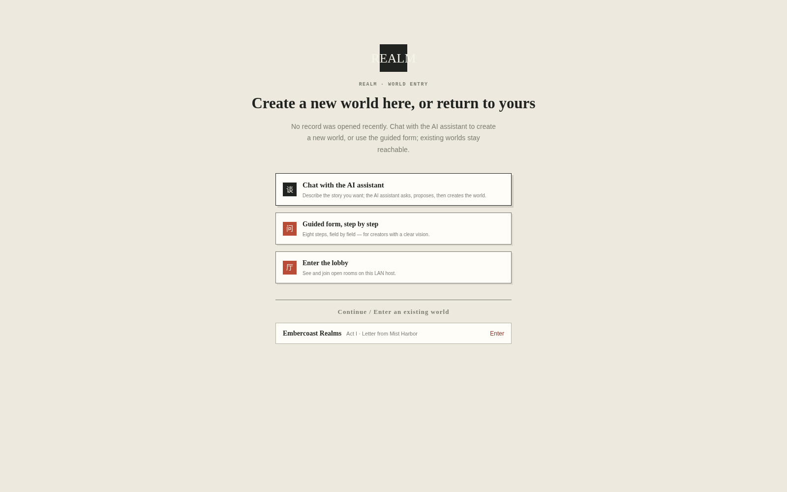
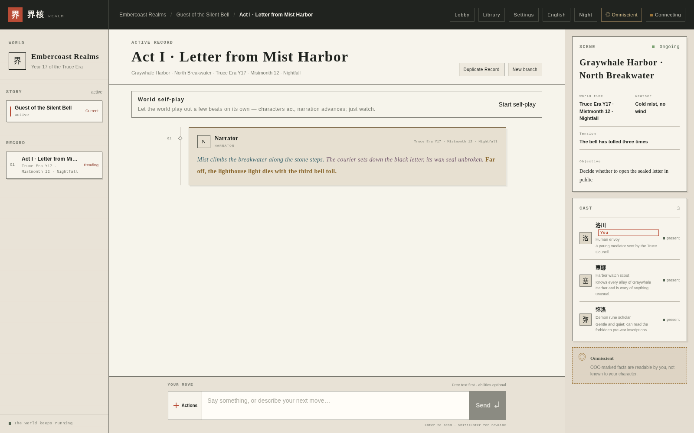

# REALM

A single-player world-building game that runs on your own computer. You talk with the world, and it keeps memories and grows with you.

[简体中文](./README.md) · [English](./README.en.md) · [日本語](./README.ja.md)



Inside a demo world with its cast (interface in English; world content language follows the world's own setting):



> Double-click the launcher, follow the prompts, and the world entry above opens in your browser. On the first launch, the installer checks what is missing and asks before installing anything.

## I just want to play

Don't have the project folder yet? One terminal command fetches it and sets everything up (it asks before installing anything):

**Linux / macOS (Apple Silicon):**

```bash
curl -fsSL https://raw.githubusercontent.com/Silver-Aurora/REALM/main/scripts/install.sh | bash
```

No Docker and no system PostgreSQL? Add `--embedded-pg` and the installer downloads the per-platform embedded PostgreSQL 17+pgvector artifact (linux-x64 / darwin-arm64 / windows-x64, built by GitHub Actions with SHA256 checksums) into your user directory:

```bash
curl -fsSL https://raw.githubusercontent.com/Silver-Aurora/REALM/main/scripts/install.sh | bash -s -- --embedded-pg
```

**Windows (PowerShell, x64):**

> ⚠️ Run these in **PowerShell** (right-click Start → "Terminal" / "Windows PowerShell"), **not** in "Command Prompt cmd" — `iex`/`irm` are PowerShell commands and cmd reports "not recognized". On cmd, type `powershell` and Enter first, or just double-click `install.cmd`.

```powershell
irm https://raw.githubusercontent.com/Silver-Aurora/REALM/main/scripts/install.ps1 | iex
```

One-liner with the embedded PostgreSQL:

```powershell
iex "& { $(irm https://raw.githubusercontent.com/Silver-Aurora/REALM/main/scripts/install.ps1) } -EmbeddedPg"
```

Or from a folder you already cloned:

```bash
bash scripts/install.sh --embedded-pg   # Linux / macOS
.\scripts\install.ps1 -EmbeddedPg       # Windows PowerShell
```

> macOS requires Apple Silicon (M-series). On an Intel Mac, install PostgreSQL 17 + pgvector with Homebrew and setup-web will detect it.
> The raw URLs above work as soon as the repository is made Public; while it is private, clone first and run the local scripts.

### Upgrading

**Re-running the same command is a full upgrade**: the installer fetches the latest source, updates dependencies, and compares the embedded PostgreSQL version — skipping when already current, otherwise downloading the new artifact, verifying SHA256, and swapping the old install with a backup (automatic rollback on failure). Your database stays untouched.

```bash
curl -fsSL https://raw.githubusercontent.com/Silver-Aurora/REALM/main/scripts/install.sh | bash -s -- --embedded-pg
```

Programs and data live apart: binaries under `~/.local/realm-pgsql/<version>`, database under `~/.local/realm-pgsql/data` — upgrades only replace the binaries.

If you already have the REALM project folder, choose the entry point for your system.

### Windows

Double-click:

```text
START-REALM-Windows.cmd
```

If Windows shows a PowerShell or security prompt, allow it to run. Follow the messages in the black window and type `Y` when the launcher asks for permission to install something.

### macOS

Double-click:

```text
START-REALM.command
```

If macOS blocks it the first time, right-click the file in Finder, choose **Open**, and confirm.

### Linux

Open a terminal in the project folder and run:

```bash
bash START-REALM-Linux.sh
```

The launcher will:

1. check Node.js and npm;
2. check PostgreSQL/pgvector or Docker;
3. show missing items and ask before installing them;
4. create local configuration;
5. start a local database;
6. initialize REALM and load the demo world;
7. start the web server and open your browser.

When the REALM page appears, you can start playing. Keep the terminal window open while you play. Press `Ctrl+C` to stop the web server.

## First launch: choose a model

REALM needs a model provider for world generation and character responses. Open the settings page after launch and choose one:

- a local service such as LM Studio, using its local URL and model name;
- an OpenAI-compatible service, using its URL, model name, and API key;
- without a model service, you can still browse the interface and demo data, but AI generation will not run.

API keys belong in your local configuration only. Do not paste them into issues, chats, logs, or Git.

## If the launcher does not start

Run the read-only environment check from the project folder:

```bash
node scripts/setup-web.mjs --check
```

This only checks the machine. It does not install anything, edit configuration, or start a database.

Common cases:

- **Node.js is missing or too old:**
  - macOS/Linux: run `bash scripts/setup-web.sh`. If Homebrew is available, it can install Node.js 22 after confirmation;
  - Windows: double-click `START-REALM-Windows.cmd`, or run `scripts/setup-web.ps1` in PowerShell. If winget is available, it can install Node.js LTS after confirmation;
  - if the installer asks you to open a new terminal, do that and run the launcher again.
- **Docker Desktop is not running on Windows:** start Docker Desktop, wait until it is ready, and run the launcher again. The first Docker Desktop setup may ask you to accept terms or restart Windows.
- **Homebrew is not installed on macOS:** install it from [brew.sh](https://brew.sh), then run the launcher again. Docker Desktop is another option.
- **A port is already in use:** the launcher searches for another local port. Use the URL printed at the end of the terminal output.
- **The browser did not open:** copy the final `http://127.0.0.1:...` address into Chrome, Edge, Safari, or Firefox.
- **An install failed:** do not delete the database in a hurry. Save the last error message and run the launcher again; it will reuse local data where possible.

## Data and privacy

REALM binds to `127.0.0.1` by default. It does not expose itself to your LAN or the public internet.

- Docker mode stores PostgreSQL data in a local Docker volume;
- local PostgreSQL mode stores data in the project-local data directory;
- `.env.local` is local configuration and must not be committed;
- removing application files does not automatically remove your worlds. Back them up first.

## What can you play with now

REALM keeps conversation, character memory, world knowledge, and Record-level events in one readable world. Available today:

- World / Story / Record navigation;
- recoverable conversation turns and a single writer per Record;
- character memory, world knowledge, scene crystallization, and Canon review;
- rules, dice, presence, and world self-play;
- PostgreSQL + pgvector persistence;
- multiple model-provider settings and structured-output repair;
- a rectangular paper-and-ink interface.

## Command-line options

If you are comfortable with a terminal:

```bash
# check the machine without changing anything
node scripts/setup-web.mjs --check

# interactive setup and launch, recommended
node scripts/setup-web.mjs

# accept all installation and local-configuration prompts
node scripts/setup-web.mjs --yes

# launch without opening a browser
node scripts/setup-web.mjs --no-open
```

Use `--yes` only on a machine and network you trust. The interactive mode is safer by default.

## Documentation

- [Web bootstrap](./docs/WEB-BOOTSTRAP.md)
- [Getting started](./docs/GETTING-STARTED.md)
- [Configuration](./docs/CONFIGURATION.md)
- [Self-hosting boundaries](./docs/SELF-HOSTING.md)
- [Desktop preview packages](./docs/DESKTOP-INSTALLATION.md)
- [System design](./docs/architecture/SYSTEM-DESIGN.md)

## Verification for contributors

```bash
npm test
npm run lint
npm run typecheck
```

The full test suite uses a disposable PostgreSQL scratch cluster. It must not connect to a personal or production database.

## License

REALM is available under the [Apache-2.0 License](./LICENSE).
