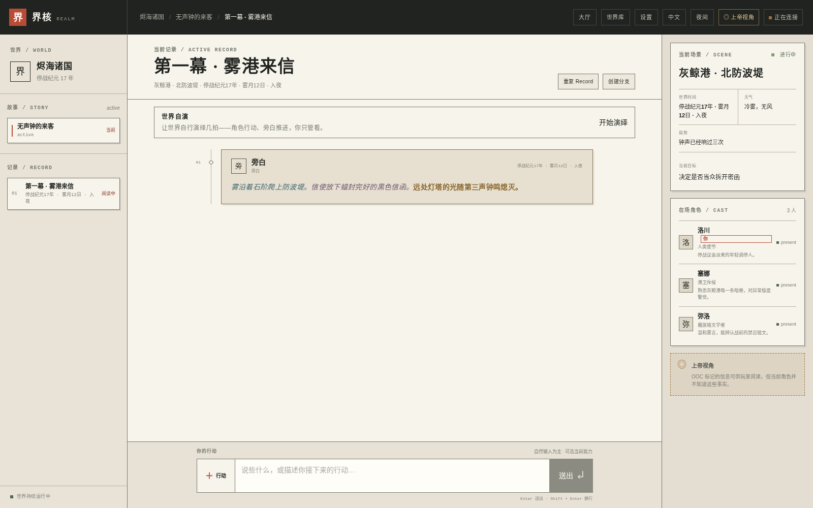

# REALM

一款在你自己的电脑上运行的单人世界构筑游戏。你和 AI 对话，世界会留下记忆，也会继续生长。

[简体中文](./README.md) · [English](./README.en.md) · [日本語](./README.ja.md)


在演示世界中与角色同行（界面为中文，世界内容语言由世界设定决定）：



> 双击启动器，跟着提示走，浏览器打开后就是上面的世界入口。第一次启动时，启动器会告诉你电脑里缺什么，并在你确认后装好。

## 我只想马上玩

还没有项目文件夹？一条终端命令即可拉取并完成全部设置（安装任何内容前都会先问你）：

**Linux / macOS（Apple Silicon）：**

```bash
curl -fsSL https://raw.githubusercontent.com/Silver-Aurora/REALM/main/scripts/install.sh | bash -s -- --embedded-pg
```

**Windows（PowerShell，x64）：**

> ⚠️ 以下命令必须在 **PowerShell** 里运行（右键开始菜单 →「终端」或「Windows PowerShell」），不是「命令提示符 cmd」——`iex`/`irm` 是 PowerShell 命令，cmd 会报「不是内部或外部命令」。cmd 用户先输入 `powershell` 回车切换，或直接双击 `install.cmd`。

```powershell
iex "& { $(irm https://raw.githubusercontent.com/Silver-Aurora/REALM/main/scripts/install.ps1) } -EmbeddedPg"
```

以上命令会自动下载对应平台的嵌入式 PostgreSQL 17+pgvector 构件（linux-x64 / darwin-arm64 / windows-x64，由 GitHub Actions 构建并附 SHA256 校验），装进用户目录、完成全部初始化。

**已经有 PostgreSQL 17 + pgvector，或者用 Docker 的进阶用户**，去掉 `--embedded-pg` 即可，安装器会自动探测现有环境：

```bash
curl -fsSL https://raw.githubusercontent.com/Silver-Aurora/REALM/main/scripts/install.sh | bash
```

```powershell
irm https://raw.githubusercontent.com/Silver-Aurora/REALM/main/scripts/install.ps1 | iex
```

或者在你已经克隆好的文件夹里运行：

```bash
bash scripts/install.sh --embedded-pg   # Linux / macOS
.\scripts\install.ps1 -EmbeddedPg       # Windows PowerShell
```

> macOS 仅支持 Apple Silicon（M 系芯片）；Intel Mac 请用 Homebrew 安装 PostgreSQL 17 + pgvector，setup-web 会自动探测到。

### 升级

**重跑同一条命令就是完整升级**：安装器会拉取最新源码、更新依赖，并对嵌入式 PostgreSQL 做版本比较——已是最新则跳过，有新版本则自动下载、校验 SHA256、备份式替换旧构件（失败自动回滚），数据库数据原地不动。

```bash
curl -fsSL https://raw.githubusercontent.com/Silver-Aurora/REALM/main/scripts/install.sh | bash -s -- --embedded-pg
```

数据与程序分离存放：程序在 `~/.local/realm-pgsql/<版本>`，数据库在 `~/.local/realm-pgsql/data`——升级只换程序，世界安然无恙。

### 关闭

**Ctrl+C 或关闭终端 = 全部关闭**：REALM 停止时，它启动的数据库（嵌入式/系统 PostgreSQL 或 Docker 容器）会跟随停止，不会留下孤儿进程。下次运行同一条安装命令会自动重启。你的数据（世界、角色、记录）都安好在数据目录里，不受启停影响。

如果你已经拿到了 REALM 项目文件夹，按系统选择一个入口：

### Windows

双击：

```text
START-REALM-Windows.cmd
```

如果 Windows 弹出 PowerShell 或安全提示，选择允许运行。之后照着黑色窗口里的提示操作，看到安装确认时输入 `Y`。

### macOS

双击：

```text
START-REALM.command
```

如果 macOS 第一次阻止打开：在 Finder 里右键这个文件，选择“打开”，再确认一次。

### Linux

在项目文件夹里打开终端，运行：

```bash
bash START-REALM-Linux.sh
```

启动器会完成这些事情：

1. 检查 Node.js 和 npm；
2. 检查 PostgreSQL/pgvector 或 Docker；
3. 把缺少的依赖列出来，等你确认后再安装；
4. 创建本地配置；
5. 启动本地数据库；
6. 初始化 REALM、载入演示世界；
7. 启动网页并自动打开浏览器。

看到浏览器里的 REALM 页面后，就可以开始玩了。启动用的终端窗口要保持打开；按 `Ctrl+C` 会停止网页服务。

## 第一次打开后要做什么

REALM 的世界逻辑需要一个模型提供方。首次进入后打开设置页，选择你要使用的模型：

- 你有本地模型服务，例如 LM Studio：填写本地地址和模型名；
- 你有 OpenAI-compatible 服务：填写服务地址、模型名和 API key；
- 没有模型服务时，页面和演示数据仍可以查看，但 AI 生成不会工作。

API key 只保存在你自己的本地配置中。不要把它贴进 Issue、聊天、日志或 Git。

## 如果启动器没有打开

先在项目文件夹里运行只读检查：

```bash
node scripts/setup-web.mjs --check
```

它只检查环境，不安装、不改配置、不启动数据库。

常见情况：

- **Node.js 太旧或没有安装：**
  - macOS/Linux：运行 `bash scripts/setup-web.sh`。有 Homebrew 时，它会在确认后安装 Node.js 22；
  - Windows：双击 `START-REALM-Windows.cmd`，或在 PowerShell 中运行 `scripts/setup-web.ps1`。有 winget 时，它会在确认后安装 Node.js LTS；
  - 安装 Node.js 后，如果窗口提示重新打开终端，请照做，再重新运行启动器。
- **Windows 的 Docker Desktop 没启动：** 启动 Docker Desktop，等它显示运行中，再重新双击启动器。第一次使用 Docker Desktop 可能需要接受许可或重启 Windows。
- **macOS 没有 Homebrew：** 从 [brew.sh](https://brew.sh) 安装 Homebrew，再重新运行启动器。也可以先安装 Docker Desktop。
- **端口被占用：** 启动器会自动寻找附近的本地端口，浏览器打开的地址以终端最后显示的地址为准。
- **浏览器没有自动打开：** 复制终端最后的 `http://127.0.0.1:...` 地址，粘贴到 Chrome、Edge、Safari 或 Firefox。
- **安装中途失败：** 不要反复删除数据库。把终端最后的错误信息保存下来，重新运行启动器；它会复用已有的本地数据。

## 数据和隐私

REALM 默认只绑定本机 `127.0.0.1`，不会自动向局域网或公网开放。

- Docker 模式使用本机 Docker volume 保存 PostgreSQL 数据；
- 本地 PostgreSQL 模式使用项目的本地数据目录；
- `.env.local` 是本机配置，不应提交到 Git；
- 删除程序文件不会自动删除你的世界数据，请先备份。

## REALM 里现在能玩到什么

REALM 把对话、角色记忆、世界知识和 Record 级事件放在同一个可回读的世界里：

- World / Story / Record 导航；
- 可恢复的对话回合和单写入者 Record；
- 角色记忆、世界知识、场景结晶和 Canon 审阅；
- 规则、骰子、在场和世界自演；
- PostgreSQL + pgvector 持久化；
- 多模型提供方设置和结构化输出修复；
- 纸张与墨水风格的矩形界面。

## 命令行选项

已经熟悉终端后，可以直接运行：

```bash
# 检查环境，不产生副作用
node scripts/setup-web.mjs --check

# 交互式安装和启动，推荐
node scripts/setup-web.mjs

# 接受所有安装/本地配置确认
node scripts/setup-web.mjs --yes

# 启动但不自动打开浏览器
node scripts/setup-web.mjs --no-open
```

`--yes` 只适合你完全信任当前电脑和网络环境时使用。默认交互模式更安全。

## 文档

- [Web 一键启动说明](./docs/WEB-BOOTSTRAP.md)
- [详细入门](./docs/GETTING-STARTED.md)
- [配置说明](./docs/CONFIGURATION.md)
- [自托管边界](./docs/SELF-HOSTING.md)
- [桌面预览包说明](./docs/DESKTOP-INSTALLATION.md)
- [系统设计](./docs/architecture/SYSTEM-DESIGN.md)

## 开发者验证

```bash
npm test
npm run lint
npm run typecheck
```

完整测试会使用一次性的 PostgreSQL scratch 集群，不应连接个人或生产数据库。

## 许可证

REALM 使用 [Apache-2.0 License](./LICENSE)。
