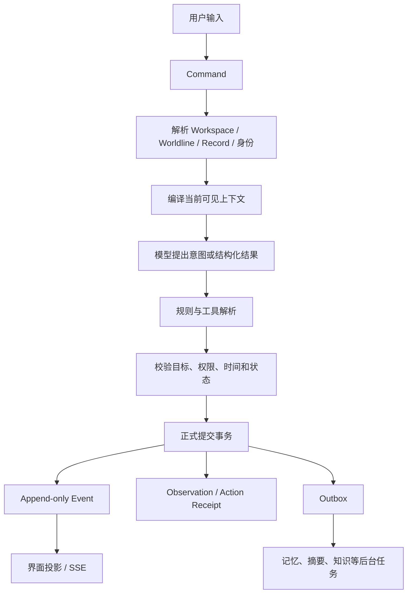

# REALM 系统设计

> 本文说明 REALM 的系统结构、数据流和设计取舍。内容以现有代码、数据库迁移和运行时契约为准。

## 1. REALM 做了什么

REALM 是一个本地运行的长期世界系统。用户在 Web 页面中创建或进入一个世界，与角色和场景交互；系统把每次行动、规则结果、角色观察和世界变化保存下来，之后的回合再从这些正式数据中恢复上下文。

当前实现集中在几件事上：

- 用 `World → Story → Record` 管理世界、故事和具体经历；
- 用 Record Runtime 处理一回合从输入到提交的完整过程；
- 用事件、观察、知识和记忆保存不同层次的事实；
- 让每个角色只读取自己在当前时间点能够知道的内容；
- 让骰子、技能、道具和状态变化经过确定性规则处理；
- 让模型负责理解、表达和提出行动，不直接写入正式世界状态；
- 用 PostgreSQL 和 pgvector 保存长期数据、检索记忆和保护租户边界；
- 通过 Web 投影和 SSE 把已提交结果送回界面；
- 通过本地启动器完成数据库、迁移、演示数据和 Web 服务的初始化。

## 2. 核心对象

```text
World 世界
└── Story 故事
    └── Record 记录
        └── Scene 场景
            └── Turn 回合
                └── Event / Observation / Action Receipt
```

### World

World 保存长期存在的世界范围内容，例如时代、地理、规则、角色定义、世界知识和长期历史。

### Story

Story 是 World 中的一段长期叙事。它保存主线、阶段目标、当前状态以及与 Record 的关系。

### Record

Record 是一次可以继续、回放和审计的具体经历。对话、玩家行动、角色行动、工具结果、规则变化和正式提交都围绕 Record 展开。

### Worldline

Worldline 是贯穿 World、Story 和 Record 的因果坐标。它记录世界时间和顺序，也为回溯、分支和冲突检测提供边界。

Worldline 提供因果历史坐标，回答“这件事发生在哪条历史上”；用户当前打开的页面仍由 World、Story 和 Record 决定。

## 3. 一次行动如何变成世界状态

一次用户行动先进入 Command，再经过上下文编译、模型推理、规则解析和正式提交，最后形成可回读的世界状态：



### 3.1 接收与定位

服务端依据当前会话和服务端数据重新确定以下范围；客户端字段只作为请求输入：

- Workspace；
- World、Story、Record 和 Worldline；
- 当前 Record head 和世界时间游标；
- 当前 Principal 能看到的受众范围；
- 当前 CharacterInstance 及其所属的 CharacterContinuity。

这些范围在模型调用前锁定，提示词无法改写 Workspace、角色身份或可见范围。

### 3.2 上下文编译

Context Compiler 从正式数据编译一次模型调用所需的最小上下文，过滤条件包括：

- Workspace 和权限；
- Worldline 与时间游标；
- Record 和 Scene；
- 当前角色的身份与连续体；
- 角色已经获得的信息；
- 当前任务需要的世界规则、目标和工具；
- 当前受众能够看到的事件。

角色上下文只包含完成当前任务所需的世界规则、目标、工具和合法可见信息。未提交候选、过滤统计、数据库连接、API key 和其他角色的私密信息留在控制面。

### 3.3 模型输出

模型输出被当作不可信的候选数据处理。它可以表达：

- 角色想做什么；
- 角色如何说话；
- 角色对当前情境的理解；
- 需要调用哪类行动工具；
- 一段结构化的叙事或语义结果。

以下状态由服务端规则和正式事务决定：

- 骰子结果；
- 权限；
- 资产余额；
- 世界时间；
- 正式历史事实；
- 其他角色是否知道某件事。

### 3.4 规则解析与正式提交

需要规则判断的行动由服务端的 Action Resolver 和工具链处理。正式提交在 PostgreSQL 事务中完成，核心顺序是：

1. 设置事务级 Workspace；
2. 锁定 Record head；
3. 按固定顺序锁定对应 Worldline；
4. 检查版本、幂等键和请求指纹；
5. 分配 Record version、Record ordinal 和世界时间游标；
6. 追加 Event、Observation 和 Action Receipt；
7. 在同一事务内应用合法的资产与状态变化；
8. 推进 Record head 和 Worldline；
9. 写入去重后的 Outbox；
10. 标记 Command / Turn 状态；
11. 提交事务。

Record head 必须先于 Worldline 加锁，避免不同写入路径使用不同锁顺序而产生死锁。

修正已经发生的事情时，系统追加新的 Event，不修改或删除已经提交的历史。重复请求使用幂等键和输入指纹拦截，避免重试造成两次扣除、两次行动或两条相同历史。

## 4. 角色、认知与记忆

REALM 把角色拆成三个层次：

```text
CharacterDefinition   角色是什么
CharacterContinuity   角色跨 Record 的连续身份
CharacterInstance     角色在某个 Record 中的具体存在
```

角色在新 Record 中可以继承连续记忆；Record 的局部状态保留在 CharacterInstance 层。

### 4.1 观察不等于全知

事件发生后，系统会根据场景和受众生成 Observation。角色能不能读取某条 Observation，要同时满足：

- 观察对象属于它所在的角色连续体；
- 观察的可用时间已经到达；
- 角色位于允许的受众范围；
- 记录没有被新的更新或撤回结论覆盖；
- 当前 Workspace、Worldline 和 Record 边界仍然成立。

角色的“记忆”由带来源、时间、观察者和状态的可检索结论组成，完整聊天记录不会直接成为 Prompt。

### 4.2 记忆召回

合法候选集确定之后，系统再进行相关性排序。当前路径可以综合：

- 关键词；
- 向量；
- 记忆保真度；
- 时间近因；
- 当前任务相关性。

系统先确定合法候选集，再进行相似度排序，权限和时间过滤始终处在召回之前。

### 4.3 角色之间的边界

多个 AI 角色在运行时拥有不同的 Participant、CharacterInstance 和目标。消息中的 `recipientId` 明确指向接收者，避免多个角色共享一个模糊的“AI 发言人”身份。

DM、Narrator 和 Character Runner 也分别承担不同职责：

- **DM Controller：** 维护本轮目标、激活角色、检查完整性和约束；
- **Character Runner：** 按角色的认知范围表达行动与回应；
- **Narrator：** 在需要时描述当前受众可以感知的环境和结果；
- **Action Resolver：** 执行规则、工具和状态变化；
- **DM Validator：** 检查本轮是否完成、是否越过职责或世界约束。

职责分开让角色保持个性，规则由代码和工具执行。

## 5. 世界知识与长期生长

REALM 将世界事实拆成不同用途的数据：

```text
Event              发生过什么
Observation        谁实际观察到了什么
Knowledge / Memory 某个角色知道、相信或记住了什么
Claim              关于实体、关系或状态的最小事实
Relation           Claim 形成的可查询关系
Article            面向阅读的世界知识整理
Canon              经过确认、可以提升到更高层级的内容
```

这些数据都带有来源、时间或 Worldline 边界。文章、关系和检索索引从更小的事实生成或校验，模型不会直接覆盖整套世界知识。

后台任务可以在正式提交之后处理：

- 记忆提取与更新；
- 摘要和 Context 预热；
- 向量索引；
- 场景结晶；
- 世界知识图谱投影；
- Canon 提案和审阅数据。

这些派生任务只生成摘要、索引、提案和其他可重建数据；正式 Event 继续作为已确认历史的依据。

## 6. 时间、回溯与分支

世界时间由 Worldline 游标维护，Record 内还有连续的 Record ordinal。两者共同回答：

- 这件事在世界中什么时候发生；
- 它在这个 Record 中排在什么位置；
- 某个角色在当时是否已经能够知道它；
- 回溯后的变化会影响哪些未来记录。

回溯保留原数据库历史。新的行动先在因果覆盖层中运行，系统在升格时检查它与现有未来之间的冲突：

- 没有硬冲突时，可以继续形成新的正式历史；
- 发生硬冲突时，创建新的 Worldline 分支；
- 已经提交的未来 Record 保留原版本，冲突通过新的 Worldline 表达。

“重新走一次过去”会形成可追踪的历史分支，原 Record 继续保留。

## 7. 存储与安全边界

### 7.1 PostgreSQL 是正式状态的权威

PostgreSQL 保存：

- Workspace、World、Story、Record 和 Worldline；
- Record head、Turn、Event、Observation 和 Outbox；
- 角色定义、连续体、实例和关系；
- 记忆、知识、Claim、Article 和 Canon 提案；
- 规则资产、技能、效果和 Action Receipt；
- Context snapshot、版本、哈希和用量信息。

pgvector 用于记忆和世界知识的检索路径；向量、摘要、Redis 缓存和模型供应商缓存属于派生数据，正式事实仍以 PostgreSQL 记录为准。

### 7.2 RLS 与最小权限

租户数据带有 `workspace_id`，关系也把 Workspace 纳入外键约束。应用事务必须先设置事务级 Workspace；缺少该设置时，读取和写入都应被拒绝。

运行时角色和控制面角色分开：

- 普通 Runtime 角色只能访问正式运行链路需要的表和列；
- Control 角色负责受保护的 Context Manifest、Snapshot 和本地维护；
- 应用角色只拥有受 RLS 保护的运行时权限，不具备数据库管理、创建角色、删除历史或关闭保护触发器的权限。

### 7.3 模型边界

模型提供方由 ModelGateway 统一接入。当前 Web 预览支持 OpenAI-compatible 的本地或远程服务配置，包括 LM Studio 和 OpenRouter 路径。

调用前，服务端完成：

1. provider 和模型配置校验；
2. Base URL 的允许范围校验；
3. Workspace、Worldline、时间和受众过滤；
4. 结构化输出契约准备；
5. 取消、超时和错误分类。

模型供应商只接收当前生成所需的最小上下文。数据库凭据留在服务端，API key 只保存在本机配置中，不进入 Git、日志、事件或普通模型上下文。

## 8. Web 与运行方式

当前 Web 预览采用本地优先的启动方式：

```text
启动器
  → 检查 Node.js / npm / PostgreSQL / Docker
  → 用户确认缺失依赖
  → 本地数据库与 migration
  → demo seed
  → Web API + 页面
  → SSE 投递已提交事件
```

页面读取服务端投影。SSE 发送新事件提示，客户端再按版本和权限刷新完整 Record envelope；断线重连从服务端状态恢复历史。

本地默认只绑定 `127.0.0.1`。Docker 模式使用本地 pgvector 容器，数据库端口只发布到 loopback。启动器会处理常见端口占用，服务保持本机可见。

## 9. REALM 的优势

以下优势来自系统结构和运行时约束。

### 9.1 长期连续性有数据基础

世界、故事、Record、Worldline、角色连续体和记忆都以可查询、可验证、带来源的数据保存。角色跨 Record 继续存在时，系统可以区分“角色长期知道的事”和“某个场景临时看到的事”。

### 9.2 生成与事实分开

模型可以提出自然语言和行动意图，但正式状态必须经过规则解析、权限检查和数据库事务。这样既保留了模型的表达能力，也把骰子、资产、时间和历史放回可测试的代码路径。

### 9.3 秘密边界在生成前生效

系统在模型调用前按时间、Worldline、受众和认知范围收窄角色上下文。这个顺序更容易审计，也更容易做回归测试。

### 9.4 历史可以回读和恢复

Append-only Event、Record head、幂等键、Context snapshot 和 Outbox 让一次行动留下完整链路。服务中断后可以从稳定状态恢复；发生修正时追加新事实，旧历史保持可读。

### 9.5 规则与模型可以各自演进

规则工具独立于模型供应商，模型只面对结构化契约。更换 provider、升级提示词或替换检索算法时，正式提交和权限边界仍然由服务端掌握。

### 9.6 本地运行降低了使用门槛和数据暴露面

Web、PostgreSQL、pgvector 和启动器可以在同一台电脑上完成。用户可以直接管理本地世界数据；使用远程模型时，只有生成所需的最小上下文会离开本机。

### 9.7 复杂性集中在系统内部

用户界面展示世界、故事、记录和角色；运行时负责时间游标、受众快照、记忆召回、事务锁和 Outbox。复杂度集中在系统内部，界面保持清晰。

## 10. 代码入口

```text
app/                         Web 页面与 API 路由
modules/application/         应用编排与 Record 服务
modules/orchestration/       DM、角色、旁白、presence 和 self-play
modules/runtime/             回合状态、正式提交和取消
modules/inference/           ModelGateway、结构化输出和 provider 适配
modules/memory/              记忆提取、检索和上下文注入
modules/world-knowledge/      Claim、关系、文章和 Canon 相关逻辑
database/postgres/           Repository、migration、seed 和权限
scripts/                     本地启动、迁移、运行和验证脚本
tests/                       Core、应用、契约、PostgreSQL 和渲染测试
```
