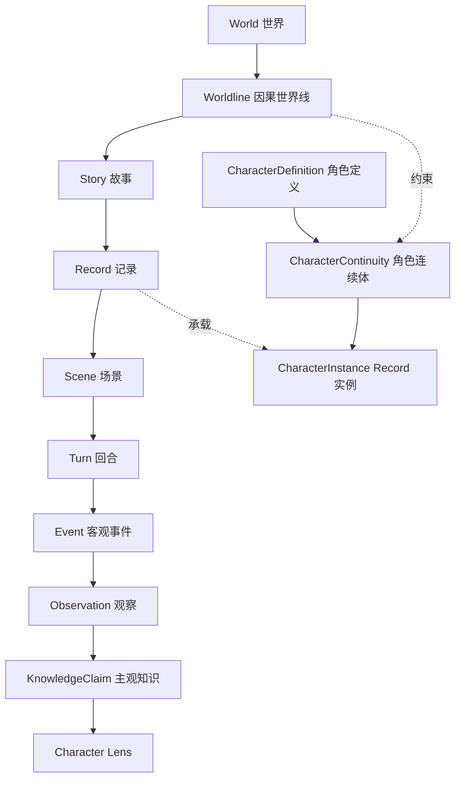
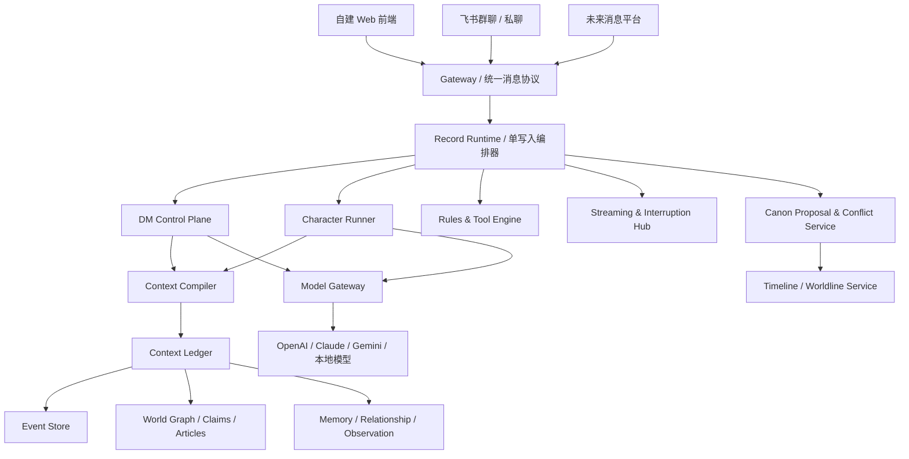
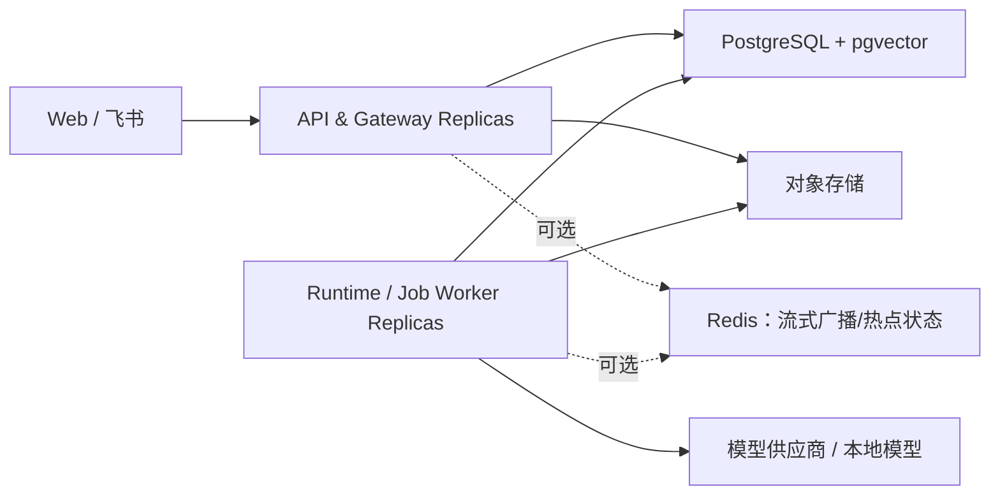
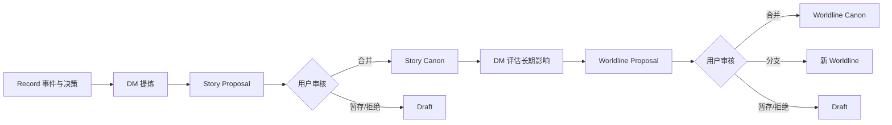

# 多人叙事角色运行时：总体设计方案

> 文档状态：概念架构评审稿 v0.1
> 目标读者：产品负责人、架构设计者、核心开发者
> 配套文档：[《多人叙事角色运行时：技术与架构方案》](./TECHNICAL-ARCHITECTURE.md)
> 本稿性质：综合既有讨论后的统一方案；文末区分“已确认决策”“架构建议”和“待审事项”

---

## 0. 执行摘要

本项目不是 SillyTavern 的换皮或飞书插件，而是一套面向长期叙事、多方参与和持续世界演化的 **Character Runtime**：

- 自建 Web 前端提供最完整体验，采用现代、克制的卡片式设计；
- 飞书等消息平台通过网关接入，飞书群天然映射多人会话，私聊机器人承担轻量主控台；
- 原生支持一对一、一对多、多对一和多对多；
- 兼容 SillyTavern 角色卡与世界书资产，但不继承 STscript、Regex、Preset、宏和运行时语义；
- 世界、故事、记录构成三层用户会话；世界线负责贯穿三层的因果分支；
- 事件流是事实证据，图谱与 Claim 是可计算知识，世界观文章是可阅读视图；
- 每个角色拥有独立的认知投影、长期记忆、关系和信息边界，而不是读取完整聊天后“假装不知道”；
- 玩家可在创建游玩身份时锁定上帝视角或角色战争迷雾；玩家 UI 视角与角色模型认知严格分离；
- DM 是叙事控制平面：维护目标与硬约束、调度角色、补全工具链、裁决结果、检查输出，并控制事实是否提交；
- 骰子、技能、道具和状态变化由确定性规则工具执行，LLM 负责意图、人格和叙事；
- 上下文通过分层 Context Ledger 保存，经 Context Compiler 按世界线、时间、可见性、角色认知和任务目的编译；
- Prompt 采用稳定前缀、不可变快照和动态增量尾部，以降低成本、提高缓存命中并缩短首 Token 延迟；
- 过去时间点的新 Record 先运行于临时因果覆盖层，升格时进行未来冲突检测；硬冲突创建世界线分支，已有未来 Record 永不被静默改写。

一句话产品定义：

> **一套能够让真人和 AI 角色在同一长期世界中共同生活、行动、保守秘密、积累记忆、改变历史并接受规则裁决的多人叙事运行时。**

---

## 1. 产品目标与边界

### 1.1 产品目标

1. 让没有技术背景的用户在很少配置下直接进入故事。
2. 让多个真人与多个 AI 角色共享一个真实的多人房间，而不是把所有真人压缩成单一 `user`。
3. 支持持续数月或数年的故事、世界演化、角色成长和跨 Record 记忆继承。
4. 同时支持自由叙事和严谨规则：角色可以自然表达，规则结果必须可验证、可追溯。
5. 正确处理时间、秘密、误解、情报传播、历史分支和角色主观认知。
6. 让复杂能力隐藏在默认配置和编译器后面，而不是将大量旋钮暴露给普通用户。
7. 支持多模型供应商，允许强弱不同、是否支持原生 Tool Calling 的模型参与同一运行时。

### 1.2 非目标

第一阶段明确不追求：

- 完整复刻 SillyTavern UI 或运行语义；
- 兼容 STscript、Regex、Prompt Preset、Quick Reply、扩展插件；
- 第一版就实现通用全自动社会模拟或无限自治 Agent 世界；
- 第一版就引入专用图数据库、微服务集群或复杂分布式事件平台；
- 让 LLM 直接拥有数据库写权限或自行决定骰子结果；
- 在所有消息平台上强行提供与自建前端相同的私密、流式和交互能力。

### 1.3 设计优先级

发生取舍时，优先级如下：

```text
时间、因果与权限正确性
> 正式状态可追溯性
> 角色自治与叙事质量
> 用户体验
> 响应速度与缓存成本
> 功能数量
```

缓存、压缩和 UI 简化都不能突破时间线、秘密与角色认知边界。

---

## 2. 统一术语与层级

### 2.1 用户可见的三层会话

```text
世界 World
└── 故事 Story
    └── 记录 Record
```

| 层级 | 定义 | 典型内容 |
|---|---|---|
| World | 长期存在的宇宙、基础法则和历史空间 | 历法、地理、种族、魔法、文明、世界级事件 |
| Story | 世界中的一条战役、主线或长期叙事 | 核心矛盾、阶段目标、阵营状态、章节进度 |
| Record | 一段具体、可回放的共同经历 | 场景、消息、行动、工具结果、决策、局部状态 |

### 2.2 非会话但贯穿系统的维度

| 概念 | 作用 |
|---|---|
| Worldline | 因果世界线；解决回溯变更、平行历史和未来冲突 |
| Scene | Record 内的空间、参与者和可见性边界 |
| Turn | 一次输入触发的运行时事务和自动响应链 |
| Character Lens | 从某个角色的时间点、身份和知识边界生成的认知投影 |
| Event | 已发生事项的不可变证据 |
| Claim | 对实体、关系或状态的最小事实断言 |
| Observation | 某个观察者实际感知到的事件投影 |
| KnowledgeClaim | 某角色在特定时间知道、相信、怀疑或误解的内容 |

Worldline 不是第四层 Session，Character Lens 也不是 Record 的子目录。它们分别是因果坐标和读取视角。

### 2.3 核心层级图



---

## 3. 总体系统架构

### 3.1 逻辑架构



### 3.2 模块职责

| 模块 | 单一职责 |
|---|---|
| Gateway | 将 Web、飞书等输入规范化为统一事件；处理身份映射、去重和平台能力降级 |
| Delivery Projector | 按 Principal Perspective、ACL 和平台能力生成玩家可见投影；永不把全量秘密交给 Gateway 脱敏 |
| Record Runtime | 对单个 Record 串行提交事件，协调 DM、角色、工具和流式输出 |
| DM Control Plane | 目标约束、激活、裁决、工具补全、输出检查和冲突提案；不直接承担可见旁白 |
| Narrator | 可选的上帝视角 Participant，只把当前受众可公开感知的环境与结果叙述出来 |
| Character Runner | 按 Character Lens 调用 AI 控制角色；真人角色输入与其共享后续检查、工具和提交链 |
| Context Ledger | 分层保存状态、摘要、来源、索引和快照 |
| Context Compiler | 为某次模型调用编译最小、合法、缓存友好的上下文 |
| Timeline / Worldline | 世界时间、因果关系、回溯覆盖层、分支和冲突影响范围 |
| World Knowledge | 实体图谱、关系、Claim、时间线事件和 Lore Article |
| Memory & Cognition | Observation、角色知识、长期记忆、主观关系及信息传播 |
| Social Diffusion | 高层情报的渠道、延迟、接触、注意、理解、相信、记忆、转述与失真模拟 |
| Rules & Tool Engine | 骰子、技能、物品、状态和权限的确定性执行 |
| Canon Service | Record → Story → Worldline Canon 的提案、审核、合并和版本化 |
| Model Gateway | 模型路由、工具协议转换、缓存适配、流式取消、用量监控 |

### 3.3 部署建议

第一阶段采用 **模块化单体**。它不是“所有代码随便互相调用的巨型单体”，而是：

> 一个代码仓库、一套领域模型、一个主事务数据库和一次统一版本发布；内部仍具有严格模块边界，并可从同一构建产物启动 API、Runtime Worker 和 Background Worker 等不同进程角色。



基础设施：

- PostgreSQL：事务数据、事件、实体、关系、Claim、快照和提案；
- pgvector：Lore、Memory、Article 的向量索引；
- PostgreSQL 全文检索：第一阶段关键词检索；只有质量或规模证明确有需要时再引入独立 BM25 服务；
- Redis（可选）：跨副本流式广播、在线状态、限流和可丢失热点缓存；不承担 Record 锁、任务权威或任何正确性依赖；
- 对象存储：图片、语音、卡片资源和附件；
- Outbox/Job Worker：摘要、Embedding、离线情报传播、缓存预热。

图谱先以关系表和递归查询实现；只有复杂多跳查询成为真实瓶颈后，再评估专用图数据库。

### 3.4 内部模块边界

建议代码按领域模块组织：

```text
identity-access       Principal、Membership、ControlGrant、ACL
world-canon           World、Worldline、CanonRevision、Claim、Article
story-record          Story、Record、Scene、Turn、Event、单写入编排
character             Definition、Continuity、Instance、状态与关系
cognition             Observation、Knowledge、Memory、社会情报传播
context               Ledger、Compiler、Snapshot、Manifest、检索
rules-assets          RulePack、Tool、骰子、技能、物品、状态事务
dm-runtime            Director、Goal、Validator、Canon Curator
model-gateway         Provider、ToolSpec 转换、缓存、流式与取消
delivery-gateway      Web/飞书输入、PrincipalProjection、消息投递
operations            Job、Outbox、审计、成本、指标和管理任务
```

边界规则：

1. 每个模块拥有自己的表、Repository 和写入 API；
2. 其他模块可以通过公开 Query/API 读取，不能绕过模块直接修改其表；
3. 跨模块工作由 Record Runtime 或显式 Application Service 编排；
4. 模块间同步使用类型化命令/返回值，异步使用版本化 Domain Event；
5. 数据库仍保留外键和事务，不为了“未来可能拆服务”提前放弃一致性；
6. 禁止共享一个无边界的 `common/service/utils` 业务层；共享内核只放 ID、时间、错误和基础 Event Header。

可使用 PostgreSQL Schema 表达所有权，例如：

```text
iam.*       world.*      narrative.*
character.* cognition.*  context.*
rules.*     delivery.*   ops.*
```

| PostgreSQL Schema | 权威数据示例 |
|---|---|
| `iam` | Principal、Membership、ControlGrant、Perspective、ACL |
| `world` | World、Worldline、CanonRevision、Entity、Claim、Article |
| `narrative` | Story、Record、Scene、Participant、Turn、Event、RecordHead |
| `character` | Definition、Continuity、Instance、状态与资产绑定 |
| `cognition` | Observation、KnowledgeClaim、Memory、Relationship、传播 Campaign/Packet |
| `context` | Snapshot、Digest、Manifest、SearchDocument、Embedding、CacheEpoch |
| `rules` | RulePack、Tool、Inventory、Item、Skill、Effect、ToolResult |
| `delivery` | Gateway Binding、Inbox、Outbox、Delivery Receipt |
| `ops` | Job、Model Usage、审计、失败和 Dead Letter |

所有业务数据必须带 `workspace_id`，高频唯一约束同时包含它，防止跨 Workspace 串数据。图谱首版仍是 `entities / relations / claims / causal_edges` 等普通关系表；专用图数据库即使以后加入，也只能是可重建查询投影，不能成为第二套事实来源。

### 3.5 进程角色

同一代码和构建产物可用不同启动参数运行：

| 进程 | 负责 | 不负责 |
|---|---|---|
| API/Gateway | HTTP/WebSocket、飞书接入、命令受理、查询和投影 | 长时间持有事务等待 LLM |
| Runtime Worker | Turn 状态机、DM/角色模型调用、工具链、按序提交 | 直接渲染平台专属 UI |
| Background Worker | Embedding、摘要、社会传播、Canon 影响扫描、缓存预热 | 改写未经验证的正式状态 |
| Scheduler | 按 world_tick/系统时间唤醒延迟任务和后台模拟 | 自行制造业务结果 |

它们可以在开发阶段运行于一个进程，在生产环境按负载独立增加副本，但仍属于同一个逻辑应用和版本。

### 3.6 Record 单写入的具体实现

PostgreSQL 是第一阶段的协调权威，Redis 不是正确性依赖。建议使用：

```text
command_inbox       外部命令幂等
record_heads        record_id、version、next_ordinal
turn_runs           可恢复回合状态机
event_store         正式不可变事件
action_candidates   模型产生但尚未提交的候选
outbox              已提交后待投递的事件
```

流程：

```text
1. API 以 external_event_id 写入 command_inbox，重复输入直接返回原结果
2. Runtime Worker 取得 Record lease / PostgreSQL advisory lock
3. 短事务内检查 record version、创建 turn.started，随后释放事务
4. DM 和角色模型在事务外并行推理，结果写入候选区
5. 单写入者重新取得锁，按最新 version 重新验证
6. Utterance Segment 逐段追加；Action Transaction 一次提交工具与状态变化
7. 同一事务更新 record head、event_store 和 outbox
8. 提交后 Worker 再投递 Web/飞书、更新索引和启动后台任务
```

任何数据库事务都不能跨越外部 LLM 调用。唯一约束使用 `(record_id, ordinal)`、`tool_call_id`、`external_event_id` 防止重复提交。Worker 崩溃后可根据 `turn_runs` 和 Event Store 从最近稳定状态恢复。

### 3.7 同步事务与异步任务

必须同步、同事务保证的内容：

- Event append 与 Record ordinal；
- Tool Result 与物品、消耗、Condition 状态；
- Canon 合并与 CanonRevision；
- ControlGrant 和 ACL 变更；
- 已释放 Utterance 与其 Visibility；
- Outbox 记录。

适合异步但必须幂等的内容：

- Embedding 与全文索引；
- 分域摘要和 Memory Candidate；
- 高层情报社会传播；
- 世界观文章草稿；
- 因果影响扫描；
- Provider Cache 预热；
- 分析指标和媒体处理。

第一阶段可以使用 PostgreSQL Job 表配合 `FOR UPDATE SKIP LOCKED`，无需立即引入 Kafka/RabbitMQ。Transactional Outbox 保证“数据库已提交但消息未投递”时可以重试，也避免先发飞书、后写库失败造成幽灵消息。

### 3.8 水平扩展方式

- API 无状态，可直接增加副本；
- Worker 竞争 Job/Record lease，不会同时提交同一 Record；
- 不同 Record 可并行执行，同一 Record 只串行提交；
- 模型推理不占数据库连接和事务；
- Redis 可用于跨副本 WebSocket 广播，但失效时可退化为数据库 Outbox 轮询；
- PostgreSQL 先通过索引、分区、连接池和只读副本扩展，再考虑拆服务。

### 3.9 什么时候才拆成微服务

拆分应由证据触发，而不是由模块数量触发。建议在以下条件之一持续出现时评估：

- 某个模块需要与其他模块相差约 3 倍以上的独立扩缩容，并持续成为主要成本；
- 经索引、批处理、缓存和查询优化后，该模块仍持续拖累核心 Turn 的 p95/p99 SLO；
- 某模块需要独立的安全、合规、网络或数据保留边界；
- 发布频率、故障域或团队所有权已明显要求独立部署；
- Event/Job 吞吐使 PostgreSQL Outbox 成为已测量瓶颈；
- 专用存储带来已经验证的收益，而不是理论上的“可能更快”。

优先可拆候选通常是媒体处理、Embedding/检索 Worker、社会传播计算和 Model Gateway。最晚拆的是 Record Runtime、Event Store、Rules Transaction 与 Canon Commit，因为它们共享最强的事务和顺序约束。

---

## 4. 核心领域模型

### 4.1 World

World 是“设定宇宙”的根容器，保存跨世界线共享的初始框架及各 Worldline 入口；它不直接代表某条分支中的当前世界状态：

```text
world_id
name
description
calendar_id
base_rule_pack_id
default_worldline_id
default_player_perspective_mode   omniscient（默认）/ character
created_at / updated_at
```

因此世界记忆必须区分：

```text
World Baseline
历法、初始法则、共同祖先设定和实体规范

Worldline Canon
某条因果历史中动态演化的地理、历史、势力、人物和法则
```

会随分支改变的地理归属、人物生死和势力关系必须绑定 Worldline 和有效时间。Record 升格的世界级事实默认进入 Worldline Canon，不自动修改所有分支共享的 World Baseline。

### 4.2 Worldline

```text
worldline_id
world_id
name
status                 provisional / active / archived
parent_worldline_id
fork_cursor
fork_event_id
fork_snapshot_id
is_primary
created_by_record_id
created_at
```

Worldline 通过父线和分支点形成因果树。分支点之前可共享事实来源和缓存快照，之后严格隔离。

#### CanonRevision

每次用户接受会改变某条 Worldline 正史的提案，都生成不可变的 CanonRevision：

```text
canon_revision_id
worldline_id
parent_revision_id
effective_change_cursor
accepted_proposal_id
content_hash
committed_at
```

CanonRevision 保证旧 Record 可以继续使用创建时的世界状态，而不会因为后来接受了一段回溯历史就在重放时发生变化。Graph、Article、Snapshot、Cache 和 Context Manifest 都必须绑定明确的 CanonRevision。

### 4.3 Story

```text
story_id
world_id
worldline_id
name
status
start_world_tick
end_world_tick
goal_state
story_snapshot_id
base_canon_revision_id
created_at / updated_at
```

Story 保存当前主线、阶段目标、冲突、章节和故事级 Canon；它可以与同一世界线内其他 Story 并存。

### 4.4 Record

Record 是具体游玩经历，不等同于数据库中的一条“记录”。

```text
record_id
world_id
worldline_id
story_id
name
status                 draft / active / completed / provisional / archived
world_started_at_tick
world_ended_at_tick
causal_parent_record_ids
base_canon_revision_id
base_snapshot_id
active_scene_id
checkpoint_id
gateway_bindings
created_at / updated_at
```

一个飞书群默认映射一个活跃 Record，但绑定关系可由私聊主控台切换。

Record 的先后不能依赖创建时间或简单的 previous 列表；主要依据 Worldline、世界时间和显式因果父项。Active Record 固定使用当前 CanonRevision，只有在显式检查点才能升级，不能在一轮进行中悄然换入新正史。

### 4.5 Scene

```text
scene_id
record_id
parent_scene_id
kind                    public / private / conspiracy / combat / travel ...
location_ids
participant_instance_ids
visibility_policy_id
started_at_tick
ended_at_tick
status
```

Scene 提供空间、在场者和默认可见性边界；事件仍可拥有更细粒度的可见性。

### 4.6 Principal、Participant 与玩家角色

**真人就是角色。** 真人账号不是世界内角色，也不作为 `human` 类型直接发言；它只是控制主体 `Principal`。真人进入世界前创建或绑定一张玩家角色卡，随后和 AI 角色一样形成 CharacterContinuity、CharacterInstance、记忆、关系、物品和认知边界。

```text
Principal（现实账号）
→ PlayerWorldMembership（该世界的玩家信息契约）
→ CharacterDefinition（玩家角色卡）
→ CharacterContinuity@Worldline（这个角色的一生）
→ CharacterInstance@Record（本次记录中的实例）
→ Participant@Record（进入当前房间的席位）
```

#### Principal

```text
principal_id
account_type
external_identity_bindings
status
created_at
```

#### Participant

Participant 表示 Record 中实际可发言或行动的世界内席位：

```text
participant_id
record_id
type                    character / narrator / system
character_instance_id   type=character 时必填
controller_mode         human / ai / hybrid
display_name
status
```

DM Controller 属于不可见控制面，不是 Participant；Narrator 是可选的可见 Participant。

消息保存 `sender_participant_id`。真人操作还保存受保护的 `origin_principal_id` 供权限和审计使用，但不会将飞书姓名、账号 ID 或 Principal 身份注入角色 Prompt。

#### PlayerWorldMembership：玩家信息契约

玩家账号、其进入世界后占用的角色 Participant，以及受控 CharacterInstance 必须分开。玩家在某个 World 中的游玩身份使用：

```text
membership_id
world_id
principal_id
primary_character_definition_id
perspective_mode             omniscient / character
perspective_locked_at
knowledge_panels_visible     world / story / character，默认均为 true
created_at / updated_at
```

世界创建向导提供两项初始选择：

1. **玩家角色是否开启上帝视角**：默认开启；玩家游玩身份创建后不可变；
2. **是否显示动态世界、故事和角色知识**：默认开启；之后可随时改变。

世界创建时会同时创建创建者的 PlayerWorldMembership 和玩家角色卡，因此该选择就在创建向导中完成并锁定。World 保存其默认值；后续玩家加入时，以该默认值预选，但仍在自己的 Membership 创建前确认。未来如需强制所有玩家使用同一模式，可增加 World 级策略，但不改变 Membership 的不可变契约。

不可变的原因不是技术限制，而是信息不可逆：已经看过密谋和未来信息的玩家不能真正“忘记”；中途从战争迷雾切到上帝视角，也会改变同一场游戏的公平性与代入契约。

数据库以 `(world_id, principal_id)` 保留不可删除的信息披露契约和审计；退出后重新加入不能通过创建新 Membership 绕过锁定。若确需另一种体验，应使用新的 World、正式分支副本或全新的 Principal，而不是修改原契约。

`perspective_mode` 只控制真人 UI 的信息投影：

```text
omniscient
可查看所有已提交的世界内事件、分支正史及角色知识；
不包括 DM 内部推理、未提交草稿、系统凭据和管理机密。

character
只查看其当前角色在该时刻可观察、已知、相信或记得的信息。
```

`knowledge_panels_visible` 只是展示偏好：关闭后隐藏动态百科和知识面板，不删除知识、不改变现场消息投影，也不改变任何 Character Context；重新开启时仍只显示该 Perspective 允许的内容。

创作者/Admin 权限与玩家 Perspective 分开。创作者可在治理工作室审核 Canon，但在游玩界面仍可使用战争迷雾身份。

真人角色与 AI 角色使用完全相同的 Character Lens。区别只在控制来源：真人的行为来自 Principal 输入，AI 的行为来自 Character Runner；任何长期记忆、知识、关系和状态更新都写入同一个 CharacterContinuity 模型。

同一玩家角色在不同 Worldline 中会拥有不同 CharacterContinuity。系统通过 `PlayerCharacterBinding(membership_id, worldline_id, continuity_id)` 绑定；Membership 中的角色定义只是默认角色资产，不能让不同世界线的记忆合并。

### 4.7 角色三层模型

```text
CharacterDefinition
角色资产模板：人格、背景、基础能力、外观、导入的 ST 角色卡

CharacterContinuity
某条 Worldline 中“这个人”的长期连续体：成长、长期记忆、关系和身份变化

CharacterInstance
该角色在一个 Record 中、某个世界时间切片上的运行时实例
```

#### CharacterDefinition

```text
character_definition_id
name
source_format            native / sillytavern_v2 / sillytavern_v3
source_payload
normalized_profile
version
created_at / updated_at
```

#### CharacterContinuity

```text
character_continuity_id
character_definition_id
world_id
worldline_id
origin_tick
status
current_state_snapshot_id
current_memory_snapshot_id
current_relationship_snapshot_id
```

#### CharacterInstance

```text
character_instance_id
character_definition_id
character_continuity_id
definition_version
world_id / worldline_id / story_id / record_id
active_from_tick / active_to_tick
location_id
state_snapshot_id
memory_snapshot_id
relationship_snapshot_id
inventory_snapshot_id
knowledge_cutoff_tick
created_at
```

实例必须格式化并冻结创建时使用的 Definition 版本与各类 Snapshot，才能复现当时的角色状态。跨 Record 延续的权威主体是 CharacterContinuity；Instance 不能通过“找系统中最新实例”或任意 `inherited_from_instance_ids` 决定继承。

### 4.8 Event

所有正式事实都由不可变 Event 提供证据：

```json
{
  "event_id": "event_3812",
  "event_type": "character.action",
  "world_id": "world_1",
  "worldline_id": "wl_a",
  "story_id": "story_1",
  "record_id": "record_104",
  "scene_id": "scene_gate",
  "turn_id": "turn_2048",
  "effective_cursor": {"world_tick": 18273642, "ordinal": 17},
  "created_at": "2026-08-12T10:31:04Z",
  "committed_at": "2026-08-12T10:31:06Z",
  "actor_participant_id": "participant_lilia",
  "submitted_by_principal_id": "principal_7",
  "generated_by_model_run_id": null,
  "control_grant_id": "grant_12",
  "target_ids": ["guard_22"],
  "caused_by_event_ids": ["event_3810"],
  "visibility_policy_id": "visibility_91",
  "payload": {}
}
```

关键区别：

- `effective_cursor`：世界观内何时发生，以及同一 tick 下的稳定顺序；
- `created_at`：系统何时生成草稿或请求；
- `committed_at`：何时通过检查成为正式事件；
- `caused_by_event_ids`：因果来源；

Event 一旦提交，表示“这件事确实发生过”。例如 `Bob 说魔王已死` 这一发言事件是真实发生的；“魔王已死”是否为真、传闻或误解属于 Claim/KnowledgeClaim，而不是 Event 的真假字段。历史更正通过追加 supersede/retract 事件完成，不能原地修改 Event。

`submitted_by_principal_id`、模型运行 ID 和 ControlGrant 是受保护的操作来源，不属于世界内角色可见内容。真人角色与 AI 角色经过同一套 DM、Tool 和 Event 流程；两者只在行动草稿来源上不同。

### 4.9 Observation 与 KnowledgeClaim

Event 说明客观发生了什么；Observation 说明谁感知到了什么；KnowledgeClaim 说明角色最终如何理解和相信。

```text
Event
→ Visibility Resolver
→ Observation
→ Cognition / Fidelity
→ KnowledgeClaim
→ Memory Consolidation
```

这种分离是密谋、偷听、误会、秘密阵营和时间安全 Prefetch 的基础。

### 4.10 Memory 与 Relationship

Memory 类型：

- Episodic：具体经历；
- Semantic：从经历中提炼的稳定认知；
- Decision：承诺、协议和关键决定；
- Summary：角色、Record、Story 或 Worldline 的压缩摘要。

Relationship 是有方向、有证据的主观状态：

```text
from_continuity_id
to_participant_or_continuity_id
trust / familiarity / affection / hostility / respect / debt
relationship_summary
supporting_event_ids
valid_from_tick / valid_to_tick
snapshot_version
```

世界中的客观联盟、婚姻、雇佣和敌对关系属于 World Graph；角色对他人的信任、爱憎和误解属于主观 Relationship，二者不可混用。

---

## 5. 世界时间、因果与世界线

### 5.1 双时间系统

所有时间相关对象至少区分：

```text
world_tick      世界观内的可排序时间
system_time     数据创建、提交、更新的现实时间
```

世界可使用任意显示历法：

```json
{
  "world_tick": 18273600,
  "calendar_id": "imperial_calendar",
  "display": "帝国历503年霜月12日14:30"
}
```

内部排序始终使用 `effective_cursor = {world_tick, ordinal}`，并结合因果父事件；显示文本不参与比较。运行时事件要求精确 tick，历史文章若只能确定“约三百年前”，对应 Claim 可使用估计区间和精度字段，不能伪装成精确前置条件。

### 5.2 有效时间

实体状态、关系和 Claim 使用：

```text
valid_from_tick
valid_to_tick
```

和平协定不会删除“曾经交战”，而是结束旧关系的有效区间，再创建新关系。

### 5.3 Record 的时间顺序

Record 创建时间不决定故事先后。顺序由以下信息决定：

```text
worldline_id
world_started_at_tick
world_ended_at_tick
causal_parent_record_ids
事件因果关系
```

新 CharacterInstance 不能继承“系统里最新创建的实例”，只能继承：

```text
同一 CharacterContinuity
+ 同一 Worldline 或其因果祖先
+ 世界时间早于新 Record
+ 位于新 Record 的因果祖先链
```

### 5.4 过去 Record 的临时因果覆盖层

当用户选择较早时间创建 Record：

```text
读取父 Worldline 在目标 tick 的快照
→ 创建 provisional overlay / worldline
→ 新 Record 在临时因果空间游玩
→ 不污染原世界线未来
```

这不是物理复制整条世界线，而是“共同祖先快照 + 分支增量事件”。

### 5.5 升格时的因果冲突检测

DM 先把重大变化整理为 `CausalChangeSet`：

```text
新增/终止/修改的 Claim
人物出生、死亡、身份变化
势力建立、瓦解与关系变化
地点毁灭、占领或重建
世界规则与技术变化
道具生命周期和归属
受影响的 Story Goal 与 CharacterContinuity
```

冲突检测分三层：

1. **确定性冲突**：实体有效期、道具生命周期、人物生死、地点状态等直接矛盾；
2. **依赖图冲突**：后世身份、事件或目标依赖已被改变的前置 Claim；
3. **DM 语义冲突**：社会形态、动机、宗教、文化或信息传播虽未结构化矛盾，但已不再合理。

冲突分级：

| 级别 | 含义 | 默认处理 |
|---|---|---|
| none | 与已有未来兼容 | 允许合并 |
| bridgeable | 可通过合理中间事件调和 | 生成 Bridge Proposal，由用户确认 |
| hard | 不改写未来 Record 就无法兼容 | 升级为正式 Worldline 分支 |
| high-risk | 无明确矛盾，但蝴蝶效应极大 | 默认建议分支 |

正式分支点取最早出现不兼容变化的 `effective_cursor`，不一定等于该 Record 的开始时间。第一版不支持两个正式 Worldline 的通用自动合并。

### 5.6 不可静默改写未来

已有 Record 是不可变历史档案。即使用户把新分支设为主世界线：

- 旧 Record 继续属于旧 Worldline；
- 不删除、不重算、不迁移其事件；
- 只更新 `primary_worldline_id`；
- 若需迁移，克隆为候选 Record 并生成显式 Rebase Proposal。

### 5.7 并行 Record

默认禁止同一 CharacterContinuity 在同一 Worldline 的重叠世界时间中同时激活。用户若确实需要：

- 明确创建世界线分支；或
- 启用并行实例，结束后通过状态合并提案处理冲突。

绝不能在两个重叠 Record 间实时同步记忆。

---

## 6. 客观事实、秘密与角色认知

### 6.1 Record 全量保存，角色按投影读取

```text
Record Event Stream     DM 可读取完整客观事件
        │
        ├── Projection(A) 角色 A 可见
        ├── Projection(B) 角色 B 可见
        └── Projection(C) 角色 C 可见
```

角色调用永远不能直接读取 `Record.events[]`，只能读取 `RecordProjection(observer, tick)`。

### 6.2 可见性策略

事件支持：

```text
public       当前 Record 的所有参与者
scene        当前场景在场者
restricted   指定角色或群体
private      单一角色及 DM
dm_only      仅 DM
derived      通过调查、偷听、转述或推断获得
```

声明受众和实际观察者必须分开：

```text
declared_audience       原计划让谁收到
resolved_observers      经位置、能力、工具和 DM 解析后实际感知者
```

### 6.3 “密谋”作为私密 Scene 模板

```text
Record：王宫宴会
├── Scene：宴会大厅（公开）
└── Scene：密谋（restricted: Alice, Bob）
```

密谋中的私密消息、工具调用和骰子结果不会注入其他角色上下文。未参与者仍可能获得外围 Observation，例如“两人离席十分钟”，但不会知道目的地和谈话内容。

### 6.4 偷听、调查与部分信息

偷听等工具不会把原始秘密全文交给角色，而会产生保真度受限的 Observation：

```text
完全成功    得到完整内容
部分成功    得到关键词或片段
失败        只知道有人低声交谈
严重失败    可能暴露偷听行为
```

### 6.5 秘密公开使用追加事件

秘密后来被坦白、泄露或调查确认时，追加 `knowledge.revealed`，不回头修改旧事件受众。

因此系统可以准确回答：

```text
事件何时发生
角色何时第一次听说
当时听到哪个版本
何时从怀疑变为相信
```

### 6.6 摘要也受可见性约束

至少维护：

- Omniscient Summary：DM 使用；
- Public Record Summary：共同公开信息；
- Restricted Group Summary：固定秘密群体共享；
- Character Knowledge Summary：角色个人知道、相信和怀疑的内容。

绝不能用一份包含秘密的 Record Summary 给所有角色。

### 6.7 真人权限与角色认知分开

系统需要同时判断：

```text
Principal ACL      这位真人玩家是否有权在 UI 看见
Character ACL      其控制的角色在世界内是否知道
```

玩家可被允许拥有 OOC 信息，但该信息不能因此进入角色模型上下文。

### 6.8 上帝视角与战争迷雾

系统同时生成三类不同投影：

```text
DMProjection
完整客观事实与控制信息

PrincipalProjection
真人玩家在 UI 中可看的内容，由 PlayerWorldMembership.perspective_mode 决定

CharacterProjection
CharacterInstance 实际可用于推理的认知内容，永远遵守战争迷雾
```

| 玩家模式 | 现场消息与 Scene | 动态世界/故事知识 | 角色知识面板 |
|---|---|---|---|
| omniscient | 可看所有已提交的世界内场景和秘密 | 完整 Worldline Canon 与 Story 状态 | 可查看各角色所知、所信和误解，并明确标注“该角色未知” |
| character | 仅看当前角色实际可见投影 | 仅显示该角色已经发现或合理知道的部分 | 仅显示当前角色自身知识；他人只显示公开信息 |

动态知识面板若被关闭，只隐藏后两列的专门浏览界面；不会把战争迷雾切换为上帝视角，也不会改变现场消息范围。

当一个真人控制多个角色时，默认使用角色视角标签页分别查看，不自动把 A 的知识合并到 B 的 CharacterProjection。真人即使拥有 OOC 联合视野，每个角色模型仍严格隔离。

上帝视角只影响玩家的代入与观看方式，不允许将全知 PrincipalProjection 复用为角色 Prompt、角色摘要或 Character Cache。

---

## 7. 世界记忆与 Canon 治理

### 7.1 混合世界记忆模型

```text
World Memory
├── Entity Graph       实体与关系，可计算
├── Timeline Events    历史变化，可排序
├── Canon Claims       最小事实断言，可版本化
└── Lore Articles      世界观文章，可阅读
```

只保存文章会失去一致性和时间推理；只保存图谱会失去连贯叙事。三者必须由来源关联起来。

### 7.2 Entity 类型

- 地理：大陆、国家、地区、城市、建筑、遗迹；
- 历史：时代、战争、灾难、条约、王朝；
- 基础设定：物理、魔法、种族、文化、宗教、历法；
- 势力：国家、组织、家族、军队、教团、商业集团；
- 人物：统治者、历史人物、NPC、CharacterContinuity；
- 其他：道具、资源、技术、法术、语言和制度。

### 7.3 Claim 是最小事实单位

一篇文章中的复合叙述必须拆成可验证 Claim：

```text
subject
predicate
object / value
worldline_id
valid_from_tick / valid_to_tick
scope                   record / story / world
truth_status
confidence
source_event_ids
supersedes_claim_id
```

Graph Relation 可以由 Claim 投影生成；Article 必须引用它所覆盖的 Claim 和来源事件。

### 7.4 动态扩展状态

新设定按以下状态晋升：

```text
mentioned
→ record_confirmed
→ story_canon
→ world_canon
```

也可标记为：

```text
rumor / hypothesis / disputed / deprecated
```

角色随口提及的“西边失落之城”先作为传闻，不会立即变成世界正史。

### 7.5 Record → Story → Worldline 提案管线



每份提案同时包含：

1. 人类可编辑的世界观文章；
2. Entity 新增或修改；
3. Relation 和 Claim 变更；
4. Timeline Event；
5. 失效的旧 Claim；
6. 受影响目标、角色和后世 Record；
7. 冲突报告与 DM 置信度。

### 7.6 用户拥有最终 Canon 权

审核操作至少提供：

- 全部合并；
- 编辑后合并；
- 选择部分 Claim 合并；
- 仅进入 Story；
- 晋升 Worldline Canon；
- 保存为传闻；
- 创建 Worldline 分支；
- 暂存；
- 拒绝。

若用户修改文章，系统需重新提取 Claim 并再次展示差异，避免文章与图谱分裂。

### 7.7 真相不等于公开知识

事件成为 Story/Worldline Canon，只代表其在该 Worldline 客观成立，不代表所有角色知道。角色仍需通过 Observation、传播或推断获得对应 KnowledgeClaim。

---

## 8. 信息传播、角色记忆与实例继承

### 8.1 三条不可混淆的链

```text
客观事件时间线       世界实际发生了什么
角色认知时间线       角色何时通过什么渠道知道了什么
角色实例继承链       角色在哪些 Record 中经历并保留了什么
```

### 8.2 高层事件传播

高层情报直接采用完整的 **社会情报传播引擎**，而不是“身份满足就自动知道”或单一知晓率。它模拟：

> 客观事件经过观察、发布、渠道延迟、转述、失真和主观判断，最终在不同角色处形成不同版本、置信度和记忆强度的知识。

基本不变量：

1. Canon Claim、传播中的 Information Packet、角色 KnowledgeClaim 严格分离；
2. 没有传播路径就不能获得知识；身份、兴趣和智力都不能凭空创造接触；
3. 发生、发布、到达、学会和记住是不同时间；
4. 所有传播结果绑定 Worldline 和算法版本；
5. 每个概率阶段分别计算、采样和审计，不使用不可解释的综合分数；
6. 社会模拟只产生角色认知，不直接修改客观世界事实。

#### InformationCampaign

一次高层事件可建立传播 Campaign：

```text
campaign_id
worldline_id / canon_revision_id
root_event_ids / canonical_claim_ids
effective_tick
salience / complexity
affected_regions / affected_groups
security_class / disclosure_policy
algorithm_version / parameter_version
status
```

同一个和平协议可以同时产生多种信息包：贵族阅读的完整条约、面向公众的删节公告、商人之间的传闻和敌对势力的歪曲宣传。

#### InformationPacketVersion

信息包不可变，并形成传播谱系：

```text
packet_id / campaign_id / parent_packet_id
creator_node_id / created_at_tick
claim_payload[]
asserted_confidence / source_attribution
security_class / framing / omitted_claim_ids
transformations[]
semantic_fidelity_to_parent
truth_alignment_dm_only
content_hash
```

每次失真创建子 Packet，而不是覆盖原文。`semantic_fidelity_to_parent` 表示是否忠实转述上一版本；`truth_alignment_dm_only` 表示与客观事实是否一致。官方谎言可能对公告原稿高度忠实，却与世界事实完全不符。

#### 多尺度 SocialNode

传播网络不为每个无名居民建立精细 Agent，而使用多尺度节点：

```text
精确节点：CharacterContinuity、重要 NPC、统治者
组织节点：Faction、Institution、Guild、Media Outlet
聚合节点：Settlement、职业群体、阶层、区域人口
```

节点保存位置历史、身份、组织、语言、许可级别、兴趣、专业、认知特征、声誉和渠道成员关系。重要角色精确模拟；普通人口以群体分布模拟，日后成为重要 NPC 时再懒物化个人结果。

#### Channel 与 Route

通用渠道模板包括：

```text
direct_perception / face_to_face / whisper
private_letter / messenger
official_bulletin / guild_network / religious_network
market_rumor / newspaper
magical_broadcast / telepathy
```

Channel 定义速度、带宽、基础保真、访问策略、可侦测性、审查、成本和转述能力；ChannelRoute 定义节点之间在某个有效时间内的距离、质量、容量、风险和访问要求。

传播延迟逐段累加：

```text
媒介基础延迟
+ 地理旅行时间
+ 中转等待
+ 组织审批
+ 审查或加密
+ 天气、战争和道路修正
```

分布可使用 Gamma 或 Log-normal，并通过稳定种子采样。魔法广播可以近实时，商队传闻可能耗时数月。

#### Transmission 与 Exposure

```text
TransmissionAttempt
packet / sender / carrier / recipient node / channel
sent_at_tick / scheduled_delivery_tick
authorization_status / status

ExposureOutcome
contact / attention / comprehension
belief_before / belief_after
encoding / memory_strength / retransmission
feature_snapshot / random_draws / parameter_version
```

广播先投递到聚合节点，不立即展开成数万条个人消息；只有角色即将激活、用户查询其知识或其与 Story 高相关时，才物化个人 ExposureOutcome。

#### 完整传播管线

```text
高层事件
→ DM 提取可传播 Claim 与初始 Packet
→ 指定初始观察者、发布者和渠道
→ 沿社会网络调度 Transmission
→ 到达时计算 Contact
→ 计算 Attention
→ 计算 Comprehension
→ 更新 Belief
→ 计算 Memory Encoding
→ 计算 Retransmission
→ 必要时创建失真 PacketVersion
→ 形成或更新角色 KnowledgeClaim
```

直接观察是 `direct_perception` 渠道，同样进入认知管线，不绕过审计。

#### 六阶段概率模型

各特征归一化，首版可使用版本化 Logistic 模型 `σ(x)=1/(1+e^-x)`；系数属于 Rule/World Template，不在普通 UI 暴露。

1. **Contact：是否实际接触**

   先执行硬门槛：Worldline 一致、信息已经存在、路线有效、角色处于可达位置，并满足合法访问或存在显式泄密/偷听事件。硬门槛失败时概率为零。

   ```text
   P(contact) = σ(channel_reach + route_quality + membership_access
                  + repetition - geographic_friction - censorship - overload)
   ```

2. **Attention：是否注意**

   ```text
   P(attention) = σ(salience + interest_match + personal_relevance
                    + emotional_intensity + role_duty
                    - information_overload - distraction)
   ```

3. **Comprehension：是否正确理解**

   ```text
   P(comprehension) = σ(expertise_match + language_match + literacy
                        + cognitive_capacity + packet_clarity
                        - complexity - transmission_damage)
   ```

   专业能力通常比抽象智力权重更高。智力只影响理解、识别矛盾和基于已有证据推断，不能变成读心或上帝视角。

4. **Belief：相信到什么程度**

   不做一次二元抽签，而维护连续置信度：

   ```text
   new_log_odds = prior_log_odds
                + source_trust × comprehension × evidence_quality
                  × semantic_fidelity × source_independence
                + corroboration - contradiction - propaganda_suspicion
   ```

   传播谱系用于识别多个消息是否其实来自同一个谣言源，避免重复转述造成虚假的独立佐证。

5. **Memory Encoding：是否形成和保留记忆**

   ```text
   P(encode) = σ(understood_importance + emotion + personal_relevance
                 + repetition + decision_relevance
                 - fatigue - interference)
   ```

   回忆时再结合记忆强度、线索匹配、最近强化和时间衰减。关键承诺、身份变化和亲历创伤可由规则标记为不可自动遗忘。

6. **Retransmission：是否继续传播**

   ```text
   P(retransmit) = σ(role_duty + social_utility + interest + emotion
                     + audience_relevance + status_gain
                     - secrecy_risk - sanctions - cost - uncertainty)
   ```

   成功时根据理解、记忆、动机和渠道噪声生成子 PacketVersion。

#### 信息失真

优先使用可审计的结构化变换，而不是每一跳都调用 LLM：

```text
omission / simplification / uncertainty_shift
entity_substitution / magnitude_drift / time_drift
causal_drift / framing_shift
fabrication / source_misattribution
```

LLM 只用于首次将事件包装成不同受众版本、将结构化变换渲染成自然语言，以及处理复杂宣传或政治语义。所有变换都保留父 Packet 和操作列表。

#### 身份、兴趣和能力的边界

| 特征 | 可以影响 | 不能影响 |
|---|---|---|
| 身份、地点、组织 | 渠道访问、传播延迟、主动告知、转发职责 | 无传播路径时凭空知道 |
| 兴趣、目标、情绪 | 注意、记忆、调查和再传播 | 突破 ACL、提升客观理解能力 |
| 智力、语言、专业 | 理解、发现矛盾、合理推断、抵抗失真 | 接触未见信息、读取客观真相 |
| 关系与意识形态 | 来源信任、接受和叙事框架 | 改变已经发生的客观事件 |

由推理得到的知识必须保存证据来源，并标记 `derived`，不能伪装为直接观察。

#### 秘密与泄密

ACL 是概率计算前的硬门槛，但合法不可见不代表永远不会泄露。泄密必须由显式事件产生：

```text
背叛 / 疏忽 / 胁迫 / 偷听 / 窃取
→ security_breach 或 Observation Event
→ 新的受限或失真 Packet
→ 进入正常传播管线
```

系统不会用一个隐藏随机数让陌生角色突然得知秘密。可支持：

```text
natural_secrecy   可自然泄密、偷听和调查
embargo_until     到时点前禁止正式发布，但可非法泄露
author_locked     创作者硬锁，不允许自然泄露（谨慎使用）
```

权限撤销不会让已经知道的角色失忆。密谋 Scene 直接复用这套机制：参与者获得初始 Packet，外部角色只有在偷听、目击或转述后进入传播链。

#### 事件驱动、多尺度和懒模拟

传播引擎不逐 Tick 扫描全世界。触发条件包括：

- 高层事件或正式公告产生；
- 信息达到预定投递时间；
- 角色移动、加入组织或身份改变；
- Record 创建或世界时间推进；
- CharacterInstance 即将激活；
- 用户查询某角色在某时刻的知识。

精确角色保存逐次 Exposure；聚合节点保存接触比例、主要 Packet、平均置信度和饱和度；普通 NPC 日后重要时，根据其身份、地点和组织历史，用稳定随机补算个人结果。

时间桶可按渠道划分：即时渠道按分钟/小时，城市渠道按天，长途商路按周，历史传播按月/年。

#### 稳定随机与重放

每个概率阶段独立派生随机数：

```text
seed = PRF(
  private_worldline_seed,
  algorithm_version,
  campaign_id, packet_id,
  sender_node_id, recipient_node_id, channel_id,
  stage_name, attempt_index
)
```

保存算法/参数版本、Feature Snapshot Hash、随机引用、概率和值。按阶段独立派生，未来新增一个计算步骤不会改变其他阶段的旧结果。Worldline 分支点前复用旧结果，分支后使用新的私有 Seed，只重算新线后缀。

#### DM 与确定性引擎分工

DM 负责：

- 提取可传播 Claim；
- 设置显著度、复杂度、初始观察者、发布者、保密等级和候选渠道；
- 生成不同受众的初始语义版本；
- 检查自动参数是否明显违背世界观；
- 处理复杂宣传、推断和自然语言渲染。

确定性传播引擎负责路径、延迟、概率、随机采样、结构化失真、知识写入和再传播调度。DM 不能因为剧情需要直接把秘密塞给某个角色；人工覆盖必须生成可审计的 `information_override` 或 `disclosure_event`。

#### 性能边界

为防止谣言无限爆炸：

- 同一发送者、接收者、主题和时间桶去重；
- 同源重复消息合并为强化；
- 语义相同变体按结构哈希合并；
- 设置最大传播代数、跨度和最低概率；
- 低显著度 Campaign 限制在当前区域/Story；
- 广播优先进入聚合节点；
- 只对活跃或即将激活角色精确物化；
- Campaign 保存传播前沿和周期快照；
- 世界拥有计算预算，但不能改变已经确定的结果。

首版即可完整实现：

```text
ACL → 路径/延迟 → Contact → Attention → Comprehension
→ Belief → Memory → Retransmission → Distortion → KnowledgeClaim
```

控制工程规模的方式是命名角色精确模拟、城镇/势力聚合、多尺度时间桶和懒物化，而不是删除认知阶段。世界模板对普通用户只暴露少量语义设置：

```text
信息传播速度：缓慢 / 正常 / 快速
社会开放度：封闭 / 普通 / 开放
官方控制力：弱 / 中 / 强
谣言失真度：低 / 中 / 高
```

底层系数和传播审计留在 Creator Studio 高级诊断中。

第一版 PostgreSQL 逻辑表可包括：

```text
information_campaigns
information_packet_versions
social_nodes / channel_routes
transmission_attempts / exposure_outcomes
propagation_frontiers / propagation_audits
character_knowledge_claims
```

pgvector 只用于信息主题与兴趣/专业的语义匹配，不参与 ACL 决策，也不替代传播路径。

### 8.3 KnowledgeClaim 的必要时间

```text
event_occurred_at       事情何时发生
information_available_at 情报何时进入传播渠道
received_at             角色何时接触
learned_at              角色何时形成可用认知
valid_until             该认知何时失效或被推翻
```

Prefetch 必须使用 `learned_at <= 当前视角 tick`，不能只看事件发生时间。

### 8.4 长期记忆巩固

Record 检查点或结束时：

```text
角色可见的 Event / Observation
→ Memory Candidate
→ 去重、合并、重要性评估
→ 主观真实性与来源标记
→ 写入 CharacterContinuity
→ 新 Memory Snapshot
```

长期继承优先保存：

- 重大亲身经历；
- 承诺、协议、背叛与关键决定；
- 长期关系变化；
- 身份、阵营和能力变化；
- 重要物品、技能和伤病；
- 创伤、胜利及高情绪事件；
- 已确认的重要世界情报；
- 未完成目标和持续线索。

普通对话可被压缩、降权或转为摘要，但不应无依据改写。

### 8.5 新 CharacterInstance 的继承算法

```text
1. 确认目标 Worldline 与 Record 起始 tick
2. 找到同一 Continuity 的最近合法因果祖先快照
3. 汇总祖先 Instance 的长期记忆和状态变更
4. 排除发生在目标 tick 之后的知识
5. 补算空档期可能获得的高层情报
6. 生成状态、记忆、关系、物品和知识 Snapshot
7. 创建新 Instance，并保存全部来源
```

Worldline 分支时：

- 分支点前的记忆共享来源、生成独立 Snapshot；
- 分支点后的记忆严格隔离；
- Continuity 采用 copy-on-write 惰性分叉；
- 如需继续原 Story，创建绑定新 Worldline 的派生 Story；
- 实例只从本 Worldline 的因果祖先继承。

---

## 9. 分层上下文架构

### 9.1 核心定义

```text
Context Ledger
保存规范化事实、认知、记忆、摘要、索引、版本和来源

Context Compiler
面向一次具体模型调用，生成最小、合法、缓存友好的工作上下文

Context Manifest
记录该次调用注入、排除、压缩和缓存了什么
```

Context Tree 是前端展示和 Prompt 编译结果，不是把所有内容反规范化后存进一棵大 JSON 树。

### 9.2 两个正交维度

#### 作用域层级

```text
Runtime
└── World
    └── Worldline
        └── Story
            └── Record
                └── Scene
                    └── Turn
```

#### 内容类型

```text
Policy / Goal / Canon / State / Event
Lore / Observation / Knowledge / Memory
Relationship / Inventory / Tool / Summary
```

例如：

```text
scope=Worldline, type=Canon/History
scope=Scene, type=State
scope=CharacterContinuity, type=Memory
```

这种模型既能分层存储和展示，又避免把“世界、记忆、关系、工具”平铺成互不相关的条目。

### 9.3 每层的四种视图

| 视图 | 作用 |
|---|---|
| State | 实体、关系、数值、有效期等机器可计算状态 |
| Digest | 面向模型和用户的冻结摘要 |
| Sources | Event、Claim、Article、提案等来源 |
| Index | 关键词、向量、图谱与时间索引 |

默认注入 `Digest + 少量精确事实`，不直接向模型倾倒完整图谱或全部文章。

### 9.4 ContextRequest

每次上下文编译必须显式声明调用视角：

```json
{
  "consumer_type": "character",
  "principal_id": "player_1",
  "character_instance_id": "lilia_104",
  "worldline_id": "wl_a",
  "canon_revision_id": "canon_38",
  "world_tick": 18273642,
  "record_id": "record_104",
  "scene_id": "scene_7",
  "purpose": "respond",
  "trigger_event_id": "event_3812",
  "provider": "provider_x",
  "model": "model_y"
}
```

### 9.5 固定读取流程

```text
1. 验证 Principal、Participant、CharacterInstance 与控制权
2. 固定 Worldline、CanonRevision、世界时间和因果祖先
3. 选择属于该 Revision 且 valid_through_tick 不晚于当前时刻的快照
4. 解析 World → Story → Record → Scene 的有效状态
5. 应用事件 ACL、Observation、learned_at 和角色权限过滤
6. 构建角色主观 Record Projection
7. 解析显式实体、别名、引用和当前目标
8. 在已授权候选集内进行关键词、向量、图谱、时间检索
9. 加入相关记忆、关系、承诺、物品和未完成工具链
10. 去重、处理版本覆盖、事实与信念冲突
11. 按预算压缩和裁剪
12. 生成稳定前缀、动态尾部、ToolSpec 与 Context Manifest
```

强制顺序：

> Worldline、时间、ACL 和角色认知过滤必须先于向量 Top-K 和重排。

秘密内容不能先进入候选集，再指望模型自行忽略。向量索引必须支持元数据预过滤，取回后还要二次验证。

### 9.6 混合 Prefetch

候选来源：

```text
精确关键词与实体别名
语义向量
图谱邻接
时间线与近期事件
```

融合排序可采用 RRF 或类似机制，再叠加：

- 重要性；
- 时效性；
- 当前 Goal 相关性；
- Relationship 相关性；
- 未完成承诺；
- 来源可靠性。

角色上下文中明确区分：

```text
[OBSERVED]       当前直接感知
[KNOWN]          确认知道
[BELIEVED]       相信、怀疑或误解
[MEMORY]         相关经历
[RELATIONSHIPS]  主观关系
[RECENT]         当前可见事件
```

Prefetch 的严格定义是：

> 在当前 Worldline、当前世界时刻和当前角色认知边界内，找到其此刻可能记得、相信、观察或合理推断出的相关信息。

### 9.7 Token 预算

内部按三类自动分配：

```text
Fixed
角色协议、身份、世界硬规则、输出契约

Reserved
当前输入、场景、近期事件、工具结果和未闭合动作

Elastic
长期 Lore、Memory、Relationship 和历史文章
```

空间不足时优先缩减：

```text
重复文章
→ 低相关 Lore
→ 低重要性记忆
→ 较早消息原文
→ 以摘要替代细节
```

不得裁掉：当前输入、未结束工具结果、场景硬状态、当前时间地点、角色身份、关键世界法则和 Turn Contract 的硬约束。

普通用户只选择“精简 / 平衡 / 沉浸”，不直接设置 Token 比例和检索权重。

### 9.8 写入流程

```text
消息、动作或工具意图
→ Draft Event
→ Schema、权限和规则检查
→ DM 语义检查与工具链闭合
→ Objective Event 提交
→ Perception Resolver 生成 Observation
→ Cognition 生成 KnowledgeClaim
→ Memory / Relationship Candidate
→ 当前 Delta 更新
→ 检查点生成分域摘要与 Snapshot
→ 必要时生成 Story / Worldline Proposal
```

模型只能提出结构化候选和提案，不能直接改写正式状态。

### 9.9 Context Manifest

```json
{
  "context_id": "ctx_2048",
  "consumer": "lilia_104",
  "worldline_id": "wl_a",
  "canon_revision_id": "canon_38",
  "world_tick": 18273642,
  "snapshot_versions": {},
  "prefix_hash": "sha256:...",
  "stable_tokens": 6200,
  "dynamic_tokens": 780,
  "cached_tokens": 6200,
  "included": [
    {"source_id": "memory_82", "reason": "mentioned_entity", "tokens": 42}
  ],
  "filtered_counts": {
    "future": 2,
    "unauthorized": 4,
    "other_worldline": 1
  }
}
```

Manifest 用于复现回答、排查未来知识泄露、解释检索和分析成本。玩家可见版本不能展示秘密条目的标题、ID 或具体排除原因。

---

## 10. Prompt 与缓存感知编译

### 10.1 Prompt 精简原则

Prompt 只承载模型必须理解的语义；以下约束由代码保证：

- ACL 和秘密过滤；
- Worldline 与时间过滤；
- 道具持有、数值消耗和工具权限；
- Schema 校验和重复提交；
- 骰子随机性与事务；
- Cache Key 和版本控制。

稳定角色协议可以保持很短：

```text
你是 {{character}}。
只依据此刻可观察、已知或可合理推断的信息行动。
你可说话、行动、使用工具或保持沉默。
不得决定他人行动及尚未裁决的结果。
```

稳定 DM 协议：

```text
维护事实、目标与执行完整性。
激活相关角色，但不替角色决定立场。
发现规则行为时确保工具闭合。
拒绝认知越界、硬设定冲突和未裁决结果。
仅返回规定的结构化决策。
```

导入的角色卡、世界书、文章和玩家输入均属于不可信数据，不能通过“忽略系统规则”等文字升级为系统指令。

### 10.2 PromptModule

模块元数据保存在 Core，不必全部注入模型：

```text
module_id / version
scope
priority
token_budget
cache_policy
render_condition
```

Prompt 物理顺序稳定：

```text
工具与 Runtime 协议
→ 公共世界线快照
→ 公共故事快照
→ 公共 Record 检查点
→ 秘密域快照（如有）
→ 角色身份与私有记忆快照
→ 快照后的可见增量
→ 本轮检索结果
→ 当前时间、场景与工具权限
→ 当前输入和 Turn Contract
```

### 10.3 缓存分层

```text
P0 Stable Tool Bundle + Runtime Protocol
P1 Public Worldline Snapshot
P2 Public Story Snapshot
P3 Public Record Checkpoint
── Public Cache Boundary ──
P4 Restricted Group Snapshot（可选）
── Restricted Cache Boundary ──
P5 Character Identity + Private Knowledge/Memory Snapshot
── Character Cache Boundary ──
D1 快照后的可见 Delta Events
D2 本轮 Lore / Memory / Relationship 检索
D3 当前时间、场景状态和工具权限
D4 当前输入与 Turn Contract
```

DM、角色、Validator、Memory Extractor 和 Article Writer 使用不同 CacheFamily，不能为了复用强行共享 Prompt。

### 10.4 不可变 Snapshot 与 Cache Epoch

```text
WorldlineSnapshot v12
StorySnapshot v38
RecordCheckpoint v7
CharacterMemorySnapshot v19
```

快照生成后冻结；新事件追加在动态尾部。以下情况创建新 Epoch：

- Delta 过长；
- 场景或章节切换；
- DM 完成阶段摘要；
- 用户合并 Story/Worldline Proposal；
- CharacterInstance 发生重大状态变化；
- 上下文接近预算上限。

摘要即使“意思相同”，重新措辞也会破坏精确前缀，因此确认后不得每轮重写。

### 10.5 确定性序列化

稳定前缀必须：

- 模块顺序固定；
- 实体按稳定 ID 排序；
- JSON 属性顺序固定；
- 空白、换行和标题固定；
- 不包含请求时间、Trace ID、随机 ID；
- 不按每轮检索分数重排；
- 模板、工具、摘要全部版本化。

### 10.6 Tool Bundle 稳定

工具定义通常位于 Prompt 最前部，变化会使后续缓存失效。因此：

- 使用稳定的基础 Tool Bundle；
- 每轮变化的可用技能、物品和权限放在动态尾部；
- 稀有工具通过 `request_capability` 或 Tool Search 再开启专门回合；
- Core 在执行时做最终权限校验。

### 10.7 CacheFamily

至少包含：

```text
tenant/workspace
provider/model
consumer_type
prompt_template_version
runtime_protocol_version
tool_bundle_version
worldline/fork_snapshot_hash
canon_revision_id
world/story/record snapshot hashes
visibility_domain_id / acl_version
character_continuity/memory_snapshot
```

### 10.8 缓存与秘密

- Public Cache 只能包含真正公开的信息；
- Restricted Cache 只能被同一秘密域成员复用；
- Character Cache 只能用于对应连续体/实例；
- 密谋成员变化产生新的 ACL Version；
- 缓存、索引、摘要、日志和 Manifest 全部继承原内容权限；
- 高敏感场景允许关闭供应商显式缓存；
- 日志默认只保存 Hash、版本和 Token，不保存秘密正文。

玩家 UI 投影缓存与模型 Prompt 缓存必须分开。`PrincipalProjection(omniscient)` 即使已经生成，也不能成为任何 Character Cache 的前缀；`perspective_mode`、Principal ACL 和投影视角必须进入 Delivery Cache Key。动态知识面板开关只影响 UI 渲染缓存，不创建新的角色知识快照。

### 10.9 Provider Adapter

Core 表达：

```text
stable_blocks
cache_boundaries
dynamic_blocks
cache_family
expected_reuse
```

Adapter 再转成 OpenAI、Claude、Gemini 或本地推理引擎的具体缓存形式。缓存未命中只能影响成本与延迟，绝不能改变运行语义。

### 10.10 缓存观测指标

- cache read / write tokens；
- Cache Hit Ratio；
- TTFT；
- 每个 CacheFamily 的复用次数；
- Snapshot 更新频率；
- 哪个模块最常破坏前缀；
- 工具变化造成的失效；
- 缓存写入成本与后续节省。

不要为了达到最低缓存长度人为填充无用上下文。

---

## 11. DM Control Plane

### 11.1 定位

> DM Controller 是 Record 的目标守护者、发言权仲裁器、规则行动补全器与提交审核器。它保障执行链完整和世界状态可信，但不替角色决定立场，不统一改写角色表达，不篡改工具结果，也不凭叙述直接修改世界事实。

### 11.2 DM Controller 与 Narrator 分离

```text
DM Controller（不可见控制面）
├── Director             激活、沉默、顺序、插话
├── Goal Keeper          硬约束、软目标、完成条件
├── Action Interpreter   自然语言行动 → ToolIntent
├── Adjudicator          检定、规则选择、结果裁决
├── Stream Guard         片段审核与打断
├── Validator            完整性、认知、权限、世界观检查
└── Canon Curator        Record → Story → Worldline 提案

Narrator（可选 Participant）
└── 只负责玩家可见的环境与结果叙述
```

第一版可以复用同一个模型，但各职责必须拥有独立接口、短 Prompt、结构化输出和 CacheFamily，避免形成一个无限膨胀的 DM Prompt。

### 11.3 Goal 模型

```text
goal_id
scope                   world / story / scene / character / turn
owner
hardness                hard / soft
priority
visibility
valid_from_tick / valid_to_tick
completion_predicate
source_event_ids
```

层级：

```text
World Invariants    世界硬法则和不可破坏事实
Story Goals         主线方向和核心冲突，可因角色选择改变
Scene Goals         当前场景希望解决的问题
Character Goals     角色目标、秘密和承诺
Turn Contract       本轮必须闭合的动作和内部步骤
```

Soft Goal 不是铁轨。角色拒绝进入城堡时，DM 应接受选择并让冲突以合理方式演化，而不是强迫角色服从剧本。

### 11.4 Turn Contract

```json
{
  "activated": ["character_a"],
  "must_resolve": ["reply_to_question", "resolve_lock_attempt"],
  "hard_constraint_refs": ["rule_magic_lock_2"],
  "allowed_tool_bundle": "adventure_basic_v1",
  "completion": "no_pending_action_or_tool"
}
```

Contract 引用结构化 Goal/Rule ID，不重复长篇约束。

### 11.5 Validator 顺序

1. Schema、格式和状态版本检查；
2. 工具权限、前置条件、消耗与结果一致性；
3. Worldline、时间、可见性和角色认知；
4. 世界硬法则、场景连贯性和越权控制；
5. 工具链和 Turn Contract 闭合。

返回：

```text
PASS
TOOL_REQUIRED
LOCAL_REPAIR
REGENERATE
FALLBACK
REJECT
```

修复必须给出 `preserve`，只改冲突部分，避免 DM 重写角色立场和文风。Validator 即使拥有上帝视角，也只能返回最小错误类型，不能在修复指令中泄露秘密真相。

### 11.6 主观表达与客观状态

“符合世界观”不代表角色说的每句话必须为真：

- 角色可以撒谎、猜测、误解和吹嘘；
- 角色只能利用自己当时可能知道的信息；
- 角色可以尝试合理行动；
- 行动结果必须经工具或 DM 裁决；
- 世界状态只能由 Tool Result、Reducer 或批准后的 Canon Proposal 改变。

### 11.7 DM 代理工具调用

当角色模型不会调用工具时：

```text
角色自然语言表达意图
→ Action Interpreter 生成 ToolIntent
→ Core 验证和执行
→ Tool Result 返回角色
→ 角色基于结果续写
```

DM 只翻译已经表达的行动意图，不能替角色发明立场或选择。

### 11.8 失败上限

建议默认：

```text
工具规范化重试         1 次
角色局部修复           2 次
完整重新生成           1 次
DM 验证循环            3 次
自动激活轮数           按场景配置并设置硬上限
```

超过限制进入 Fallback：保留已确认工具结果，丢弃未确认状态，DM 仅给出最小环境结果，角色本轮可沉默。

---

## 12. 回合、流式输出与插话

### 12.1 两种提交语义

“整轮原子提交”与“角色可在流式过程中被打断”不能同时完全成立，因此拆分为：

```text
Utterance Commit
经过片段检查、已经说出口的语义片段；追加且不可修改

Action Transaction
工具、数值、物品、状态变化；完整验证后原子提交
```

已说出口的话是客观发言事件，但话语中的主张不会自动修改世界状态。

### 12.2 回合状态机

```text
IDLE
→ INGESTED
→ CONTEXT_READY
→ CONTRACTED
→ ACTIVATION_PLANNED
→ SPEAKER_ACTIVE
→ SEGMENT_BUFFERED
→ SEGMENT_GUARDING
```

片段阶段：

```text
纯发言
→ SEGMENT_RELEASED
→ 继续或结束

规则行动
→ TOOL_INTENT_PENDING
→ TOOL_AUTHORIZED
→ TOOL_EXECUTING
→ TOOL_RESOLVED
→ 角色续写

插话候选
→ INTERRUPT_PENDING
→ FLOOR_DECISION
→ CONTINUE / QUEUE / INTERRUPT

硬错误
→ REPAIRING / REGENERATING
```

结束阶段：

```text
FINAL_VALIDATING
→ ACTIONS_COMMITTING
→ STATE_PROJECTED
→ POSTPROCESSING
→ TURN_COMPLETED
→ IDLE
```

### 12.3 语义片段，而非 Token 级检查

DM 不检查每个 Token。分段器在以下时点触发 Stream Guard：

- 完整句或段落；
- 宣布行动结果；
- 工具调用；
- 重大世界事实；
- 达到最大缓冲长度；
- 用户或 DM 发现紧急打断条件。

未释放片段可以丢弃；已释放片段只能追加打断、纠正或澄清事件，不能静默改写。

### 12.4 发言权协议

任一时刻只有一个主要发言权持有者。DM 根据已释放且对候选角色可见的片段做：

```text
continue
queue
interrupt
pause_for_tool
abort_unreleased
```

批准打断：

1. 取消当前模型生成；
2. 丢弃未释放缓冲；
3. 保留已经说出口的片段；
4. 写入 `utterance.interrupted`；
5. 仅将插话角色实际听见的内容交给它；
6. 激活新角色。

### 12.5 经济型角色插话

不让所有角色持续并行生成回答。推荐：

```text
已释放片段
→ DM 判断潜在插话者
→ 批准 interrupt / queue
→ 才调用相应角色模型
```

运行时限制：

- 每轮最大激活角色数；
- 自动轮数上限；
- 插话冷却；
- 同角色连续发言限制；
- 相似内容去重；
- 中断嵌套上限；
- 用户显式打断优先；
- 无新信息时偏向沉默；
- 私密 Scene 只允许实际 Observer 插话。

### 12.6 推荐事件

```text
turn.started
dm.contract_created
actor.activated
utterance.segment_released
interrupt.requested
interrupt.approved
utterance.interrupted
tool.intent_detected
tool.requested
tool.resolved
turn.validated
state.committed
turn.completed
```

未释放 Token 和废弃草稿进入短期诊断存储，不进入普通 Event Store，也不进入未来上下文。

### 12.7 回合完整结束

定义为：

> 没有悬空的工具调用、未裁决动作或必须等待的内部步骤，系统能够稳定等待下一条外部消息。

被合理打断的半句话也可以成为完整、稳定的回合结果。

---

## 13. 工具与 TRPG 规则系统

### 13.1 原则

- LLM 提出意图，Core 执行规则；
- 角色不能自行声称骰子结果；
- Tool Result 才能驱动数值与状态变化；
- 所有调用可验证、可审计、幂等；
- 自由叙事和确定性规则通过事件衔接。

### 13.2 通用 ToolSpec

内部采用各主流供应商共同支持的最小交集：

```text
name
description
JSON Schema input
JSON Schema output（可选）
permissions
side_effects
idempotency policy
```

规范：

- `verb_noun` 命名；
- 一个工具只做一个动作；
- 1～5 个主要参数；
- 避免深层嵌套和复杂 union；
- 参数使用短而明确的语义名；
- `world_id`、`record_id`、actor、tick 等由 Core 绑定；
- 所有参数在执行前二次校验。

角色调用示例：

```json
{"skill":"stealth","target":"north_gate"}
```

而不是让模型填写大量运行时 ID 和时间戳。

### 13.3 三种调用路径

```text
原生 Tool Call
角色直接声明 act / use_skill / use_asset / take_stance

结构化 Adapter
弱工具模型输出 ActorActionProposal，Adapter 转为同一 Actor Tool

Intent Compiler
只做窄范围结构化；低置信度、状态变更或高价值操作拒绝/确认
```

DM 不通过自然语言关键词猜测工具，也不代理角色选择行动。Actor Tool 完成后，Action Resolver 才根据 RulePack 决定是否调用内部判定或状态工具。

### 13.4 工具状态机

```text
INTENT_OBSERVED
→ NORMALIZED
→ AUTHORIZED
→ NEEDS_CONFIRMATION（歧义或不可逆操作）
→ EXECUTING
→ RESOLVED / REJECTED / FAILED
→ RESULT_ACKNOWLEDGED
→ STATE_COMMITTED
```

### 13.5 第一版必要通用工具包

Core 不硬编码 D&D 的职业、AC、HP、法术位或 d20。第一版把角色选择与引擎裁决分成两层：

```text
Actor Tool：
act               尝试自然行动
use_skill         使用已知技能
use_asset         使用物品、装备或有限资源
take_stance       主动进入角色可控制的姿态

Engine Tool：
resolve_uncertainty  按 RulePack 解决随机、技能、属性或对抗
consume_resource     扣除物品、次数或其他资源
apply_effect         应用伤势、增益、减益或叙事状态
```

角色侧 `use_skill` 的输入保持简洁：

```json
{"skillId":"stealth","targetId":"north_gate","intent":"悄悄越过守卫视线"}
```

角色不选择 difficulty、骰面或修正。具体算法由 Action Resolver 与 RulePack 决定：

```text
narrative_lite    无骰或少量成功档位
d20               d20 + 修正值 vs 难度
2d6               日式/轻规则常见的 2d6 档位
percentile        百分骰
dice_pool         骰池成功数
token_or_card     资源、卡牌或抽签式判定
```

规则包内部可以使用 `trivial / easy / standard / hard / extreme` 等语义档位及其具体映射。DM 只检查结果是否闭合和符合世界硬约束，不能替角色选技能或任意篡改结果。没有启用某机制时，对应工具和卡片不向模型或玩家展示。

### 13.6 Asset 模型

```text
RulePack
ResolutionMechanic / DifficultyBand
ToolDefinition
SkillDefinition / ItemDefinition / ConditionDefinition
AssetInstance
Inventory
ToolCall / ToolResult
```

技能卡、道具卡和骰子卡是结构化 Asset 的前端视图，不是纯 Prompt 文本。

### 13.7 确定性保障

- 服务端随机数并保存审计信息；
- DM 可选择规则或难度，但不能篡改已经生成的结果；
- 道具转移、消耗和状态修改使用事务；
- `tool_call_id` 幂等；
- 工具失败明确产生失败事件，不改变状态；
- 角色忽略结果时仅要求局部续写，不重新掷骰；
- 不可逆且意图不明确的行为需要真人确认。

### 13.8 MCP 与供应商工具协议

MCP 适合外部规则服务和扩展工具的接入层。角色模型优先使用供应商原生 Function Calling，Model Gateway 负责与内部 ToolSpec 转换；不要求角色直接输出 MCP/JSON-RPC 报文。

---

## 14. 多人模型与控制权

### 14.1 统一表达所有人数关系

一对一、一对多、多对一、多对多不形成四套房间模式，而由 Participant 和控制权自然表达。

```text
Record
├── Character Participants[]
│   ├── human-controlled
│   ├── ai-controlled
│   └── hybrid（显式开启时）
├── Narrator（可选）
└── DM Controller（不可见）
```

因此“一对多”表示一个真人角色与多个 AI 角色互动；“多对一”表示多个真人角色与一个 AI 角色互动；“多对多”则是多个真人角色和多个 AI 角色共享 Record。所有消息仍由明确的 Character Participant 发出。

### 14.2 ControlGrant

```text
principal_id
character_continuity_id
character_instance_id        可空；为空时适用于该 Continuity 的合法实例
scope                        worldline / story / record
permissions
control_role            owner / co_controller / temporary
valid_from_at / valid_to_at    系统时间
granted_by
```

它支持：

- 真人通过自己的 CharacterInstance 参与；
- 一个 Principal 控制一个或多个明确角色（如产品场景允许切换）；
- 多人共同控制一个 CharacterInstance，但默认禁止，必须显式开启；
- AI 自主角色；
- DM 或管理员临时接管。

默认数据库约束保证一个活跃 CharacterInstance 只有一个 owner。开启多人共控后，所有输入仍需记录 `origin_principal_id`，并由 Record Runtime 按序处理；角色的记忆和关系属于 CharacterContinuity，不属于任何单一控制者。

控制权属于现实系统权限，因此有效期使用系统时间，不能使用 world_tick；否则进入回溯 Record 时会发生“权限穿越”。多人共控时每轮还需短生命周期的 `TurnControlLease`，保证同一 CharacterInstance 在一个提交位置只有一位 Principal 可以落地正式动作。

真人的 OOC 命令、切换角色和 Canon 管理属于 `control.*` 事件，不应伪装成世界内角色发言。真人输入若违反硬规则，系统优先要求澄清、检定或重新表述；不应像修复 AI 草稿一样静默改写玩家原话。

### 14.3 Record 单写入者

同一 Record 的正式事件由单一 Sequencer 提交：

- 模型推理可并行；
- 工具执行可在无状态冲突时并行；
- 最终提交按 Record 版本和 sequence 串行；
- 冲突时基于新状态重新验证，而不是覆盖。

这解决多人消息同时到达、角色并行生成和工具状态竞态。

---

## 15. Web 前端、飞书与 Gateway

### 15.1 产品入口定位

```text
自建 Web：完整产品
飞书：第一个消息网关、天然多人入口和轻量主控通道
```

Core 不依赖飞书，飞书 Adapter 也不掌握世界与角色语义。

### 15.2 普通 Web 信息架构

```text
世界卡片
└── 故事卡片
    └── 记录卡片
        ├── 当前场景与世界时间
        ├── 在场人物
        ├── 消息与旁白
        ├── 技能 / 道具 / 骰子卡
        └── 少量自然操作
```

界面原则：

- 卡片式、克制、少即是多；
- 普通用户不接触 Prompt、权重和 Token；
- 默认值覆盖绝大多数体验；
- 被打断、工具暂停、骰子结果和私密 Scene 有清晰视觉反馈；
- 草稿和内部 DM 判断永不显示。

世界创建向导用一张“玩家视角”卡片完成初始选择：

```text
玩家角色视角
● 上帝视角（默认）   查看全部已提交的世界内信息
○ 战争迷雾           只查看角色此刻知道的信息
  创建该玩家身份后不可更改

动态知识面板
[✓] 世界  [✓] 故事  [✓] 角色知识
  创建后可随时开关
```

在上帝视角中，秘密内容应有明显的 OOC/角色未知标识，避免玩家误以为该信息已经进入角色认知；战争迷雾模式不得通过搜索结果数量、隐藏卡片标题、缓存日志或“有人正在输入”等侧信道暗示秘密存在。

### 15.3 Creator Studio

复杂治理与普通游玩分开：

- 世界实体、图谱和文章；
- Story/Worldline Canon Proposal；
- Worldline 分支与冲突；
- 角色卡、认知、记忆和秘密；
- 玩家 Perspective、Principal ACL 与角色视角预览；
- Goal、规则包和工具；
- Context Manifest、缓存与成本诊断；
- 模型和网关配置。

### 15.4 Gateway 标准输入

```text
external_event_id
channel_id / thread_id
sender_identity
message_type
content
reply_target
mentions
received_at
platform_capabilities
```

Gateway 负责：身份映射、幂等、顺序、重试、撤回/编辑映射、平台速率限制和投递失败；它不负责上下文、秘密或角色选择。

### 15.5 飞书映射

- 一个飞书群绑定一个“当前活跃 Record”，可由私聊主控台切换；
- 群成员先映射 Principal，再解析其在当前 Record 中受控的玩家 CharacterInstance 与 Participant；
- @角色形成显式激活候选；
- 引用回复携带来源 Event 与目标角色；
- Thread 可映射 Scene 支线，但不自动成为新 Story；
- 私聊机器人用于创建、切换、暂停、结束、角色管理、发起密谋和 Canon 审核；
- 管理操作优先使用明确命令和交互卡片，避免自然语言误触。

飞书群是共享显示面，不能对同一条群消息为不同成员提供上帝视角与战争迷雾的不同正文。因此群内只投递所有当前成员的 **共同可见交集**；上帝视角补充、角色私有知识和个人动态面板通过 Web 或机器人私聊提供。不能因为群里有一位上帝视角玩家，就把秘密发送给同群战争迷雾玩家。

### 15.6 飞书中的密谋

普通群消息对群成员公开，因此不能在原群内假装私密：

```text
群聊发起密谋
→ Core 创建 Restricted Scene
→ 相关真人进入机器人私聊或独立私密群
→ AI 私密内容不回发原群
→ 原群只看到公开外围 Observation
```

### 15.7 流式能力降级

飞书首版采用“生成、验证、完成后一次发送”，先保证幂等、顺序和内容完整。后续再按能力升级：

```text
支持卡片更新       按完整句更新同一张卡
不适合高频更新     按段批量更新
不支持可靠流式     显示“正在发言”，完成后一次发送
```

平台 Adapter Capability 只影响表现，不改变 Core 的回合语义。

---

## 16. 数据一致性、安全与可观测性

### 16.1 一致性规则

1. Event append-only，正式事件不原地覆盖；
2. State、Graph、Summary 和 Snapshot 均为可重建投影；
3. Tool 和库存变化使用数据库事务；
4. Gateway 输入使用外部事件 ID 幂等；
5. Record 使用单写入者或乐观版本锁；
6. Canon 合并产生新版本和 Cache Epoch；
7. 所有模型结果必须经过 Schema 和权限验证。

### 16.2 权限与秘密

- Principal Account、Player Character、CharacterInstance、DM/Admin 分离；
- Principal ACL 与 Character ACL 分离；
- PlayerWorldMembership 的 Perspective 是玩家信息契约，不能替代 Character ACL；
- Gateway 只收到 Delivery Projector 已裁剪的内容；
- DM 修复指令不得泄密；
- Restricted Summary、Index、Cache、Manifest 与日志继承 ACL；
- “正在输入”、工具状态和骰子结果同样属于可见性控制范围；
- 敏感数据的供应商缓存策略可按 Workspace/Scene 配置。

由于 Perspective 不可变，普通设置接口不得更新该字段；任何数据迁移或管理员修复都必须产生审计事件。动态知识面板开关可变，但只能改变展示，不得触发 KnowledgeClaim、Memory 或 Character Context 的写入。

### 16.3 Prompt Injection 防护

- 角色卡、世界书、Lore Article 和玩家输入一律视为数据；
- 系统协议与数据区块明确分隔；
- 检索内容不能声明工具权限；
- 导入内容清理危险结构但保留原始资产；
- Validator 检测越权指令和角色认知污染；
- 工具执行永远依赖服务端权限，不依赖 Prompt 自觉。

### 16.4 核心指标

质量与安全：

```text
Secret Leakage Rate
Future Knowledge Leakage Rate
Cross-Worldline Leakage Rate
Context Precision / Recall
Summary Fact Consistency
DM Repair / False Positive Rate
Tool Completion Rate
Knowledge Provenance Coverage
Propagation Reproducibility
Unauthorized Exposure Rate
```

性能与成本：

```text
TTFT
Prompt / Completion Tokens
Cache Hit Ratio
Cache Read / Write Cost
Context Compile Latency
Turn Completion Latency
Provider Failure / Retry Rate
Propagation Queue Lag / Packet Growth
Lazy Materialization Latency
```

体验：

```text
角色沉默率与误激活率
插话接受/取消率
自动轮次长度
玩家中断率
Canon 审核积压
飞书投递失败率
```

### 16.5 安全降级

| 故障 | 降级行为 |
|---|---|
| DM 超时 | 允许纯发言；暂停自主激活和状态变更 |
| Validator 连续失败 | 保留已释放发言，丢弃未确认状态，给出最小结果 |
| Actor 断流 | 保留已释放片段并标记中止 |
| Tool 不可用 | 明确失败，不虚构结果 |
| 缓存未命中 | 只增加延迟和成本 |
| 并发写冲突 | 重新编译、重新验证，不覆盖 |
| 私密平台能力不足 | 转私聊；无法保证时禁止密谋 |
| 模型无结构化能力 | Provider 适配、Intent Compiler、有限重试，最终保守拒绝 |

---

## 17. 关键端到端消息流

### 17.1 普通多人消息

```text
玩家消息
→ Gateway 规范化与去重
→ Record Runtime 排序
→ DM 创建 Turn Contract、选择激活角色
→ Context Compiler 为角色生成认知投影
→ Character Runner 流式生成
→ 语义片段 Guard 后释放
→ DM 判断继续、排队或插话
→ 工具意图进入 Rules Engine
→ Validator 检查完整性
→ Action Transaction 提交
→ Observation / Memory / Relationship 更新
→ Delivery Projector 向各接收者投影
```

### 17.2 密谋

```text
发起密谋
→ Restricted Scene
→ 私密参与者和 Principal ACL
→ 私密 Event
→ 实际 Observer 解析
→ 非参与角色仅获得外围 Observation
→ 分域摘要和缓存
→ 后续泄密通过 knowledge.revealed 追加
```

### 17.3 角色使用技能

```text
角色：“我试着悄悄越过北门。”
→ Character Tool Call：use_skill(stealth, north_gate, "避开守卫")
→ Core 绑定 actor、Record、tick
→ Action Resolver 验证能力与状态
→ RulePack 决定自动结果或内部 resolve_uncertainty
→ 形成 Action Receipt：公开事实、角色 Observation、效果与成本
→ Narrator/角色分别根据授权结果续写，不读取机械细节
→ DM 检查身份、事务和输出边界
→ 状态和发言提交
```

### 17.4 回溯历史

```text
用户选择过去 tick
→ 从父 Worldline 快照创建 provisional overlay
→ Record 正常游玩
→ DM 生成 CausalChangeSet
→ 确定性 + 依赖图 + 语义冲突检测
→ 用户选择合并、Bridge、分支或放弃
→ 新 CanonRevision / Snapshot / Worldline / Cache Epoch
→ 已有未来 Record 保持不变
```

### 17.5 高层情报传播

```text
帝国政变 Event 提交
→ DM 提取原子 Claim，建立 Campaign
→ 生成宫廷密报、官方公告和民间传闻三个 Packet
→ 各 Packet 沿信使、公告和商路 Channel 调度
→ 聚合节点推进传播前沿
→ 目标 CharacterInstance 激活时懒物化 Exposure
→ 分别计算接触、注意、理解、相信、记忆和转述
→ 形成不同到达时间、保真度和置信度的 KnowledgeClaim
→ Prefetch 只注入该角色在当前 tick 已形成的版本
```

---

## 18. 实施路线

### 阶段 0：冻结运行时契约

即使能力暂未完成，第一天就定义：

- World / Worldline / Story / Record / Scene / Turn；
- CanonRevision 与 Record 固定 Revision；
- Participant / Principal / PlayerWorldMembership / ControlGrant；
- CharacterDefinition / Continuity / Instance；
- Event Header 与 world_tick；
- VisibilityPolicy / Observation；
- InformationCampaign / Packet / SocialNode / Channel / Exposure；
- ToolSpec / ToolResult；
- Goal / TurnContract；
- Provider / Gateway 接口；
- Snapshot / ContextManifest；
- Record Runtime 状态机。

### 阶段 1：可玩的垂直闭环

- 自建 Web 卡片式聊天；
- World → Story → Record 基础导航；
- 上帝视角/战争迷雾信息契约与动态知识面板开关；
- 真人与 AI 共用 Character Participant，Principal 仅作为控制主体；
- 角色卡与 ST 世界书导入；
- DM 激活、沉默、Turn Contract 与 Validator；
- 整句缓冲或完成后输出；
- `act`、`use_skill` 与 Action Resolver；
- 引擎内部 `resolve_uncertainty`；
- 结构化 Intent Compiler 降级，不使用 DM Proxy；
- 飞书群绑定 Record，完成后一次发送；
- 私聊基础主控台；
- Event Store、基本快照和日志。

### 阶段 2：时间安全上下文与长期角色

- Worldline、world_tick 和有效时间；
- CharacterContinuity 与跨 Record 继承；
- Observation / KnowledgeClaim；
- 关键词 + 向量混合 Prefetch；
- Memory / Relationship；
- Context Manifest；
- Stable Prefix / Delta / Cache Epoch；
- 完整社会传播数据契约：Campaign、Packet、SocialNode、Channel、Exposure；
- ACL、路径/延迟、接触、注意、理解、相信、记忆、再传播和结构化失真；
- 命名角色精确模拟、群体聚合、懒物化、稳定随机与传播审计。

### 阶段 3：可靠流式与多人自治

- 语义片段缓冲和 Stream Guard；
- 用户显式打断；
- DM 自动批准角色插话；
- 发言权、队列、冷却和取消；
- 工具暂停后续写；
- 飞书卡片按句或段更新；
- 完整重试和 Fallback。

实现顺序：先用户打断，再自动角色插话。

### 阶段 4：秘密与复杂规则

- Restricted Scene 与密谋 UI；
- Per-Character Record Projection；
- 偷听、调查和部分保真 Observation；
- 飞书私密路径；
- 私人任务、秘密阵营；
- Condition、Initiative、库存事务；
- 可插拔 RulePack。

可见性字段必须从阶段 0 存在，避免后续数据迁移。

### 阶段 5：世界治理与历史分支

- Entity / Relation / Claim / Article；
- Record → Story → Worldline Proposal；
- 用户 Canon 审核工作台；
- 回溯 CausalChangeSet；
- 后世冲突扫描、Bridge Proposal；
- Worldline 正式分支和主线切换；
- 分支缓存和角色连续体；
- 世界长期演化分析。

---

## 19. 已确认的产品与架构决策

1. 上下文按作用域分层、按内容类型分类，不平铺展示。
2. 记忆采用关键词、向量、图谱和时间联合检索，ACL 与时间过滤优先。
3. Web 前端采用优雅现代的卡片语言，默认少选项、低学习成本。
4. 统一 Participant 模型原生覆盖一对一、一对多、多对一和多对多。
5. 用户会话为 World → Story → Record；每层都有持久化摘要、决策和状态。
6. Worldline 处理因果分支，不成为日常 UI 的第四层会话。
7. Web 是完整体验；飞书是第一个 Gateway，群聊提供多人入口，私聊提供主控。
8. DM 负责 Goal、激活、规则链补全和输出检查，但不替角色决定立场。
9. 角色流式输出支持 DM 仲裁的插话和打断。
10. Lore、Memory、Relationship 分开存储、联合编译。
11. 只兼容 SillyTavern 角色卡和世界书资产。
12. 原生支持骰子、技能、道具、状态等 Tool Call 与卡片交互。
13. Record 事件带世界时间、系统时间、顺序、因果和可见性字段。
14. CharacterInstance 格式化并绑定 Definition、Continuity、Worldline 和 Snapshot。
15. 角色只获得当前时间点合理知道的内容。
16. 世界记忆同时使用图谱、Claim、时间线和世界观文章。
17. Record 的关键事实由 DM 提炼，经用户批准进入 Story/Worldline Canon。
18. 密谋使用 Restricted Scene 和 Event Visibility；其他角色上下文不注入秘密。
19. Prompt 采用稳定前缀、不可变快照和动态尾部以优化缓存。
20. 过去 Record 先进入临时因果覆盖层；硬冲突建立 Worldline 分支。
21. 已存在的未来 Record 永不被静默改写。
22. 玩家可选择上帝视角或角色战争迷雾；该玩家游玩身份创建后不可变，默认上帝视角。
23. 动态世界、故事和角色知识面板默认开启，创建后可随时开关。
24. 玩家 UI Perspective 与 Character Context 完全分离，上帝视角不会让角色模型获得全知。
25. DM Controller 与 Narrator 分离；Narrator 默认上帝视角，但只叙述受众可公开感知的结果。
26. Utterance Commit 与 Action Transaction 分离。
27. 每个 Record 采用逻辑单写入者；模型可并行，正式状态按序提交。
28. 真人必须通过拥有角色卡的 CharacterInstance 参与世界；真人和 AI 角色只在控制来源上不同。
29. 一个角色多人共控默认禁止，显式开启后使用 ControlGrant 与 TurnControlLease。
30. 通用 TRPG 工具包先行，不绑定完整 D&D；轻设定、日式设定可按 RulePack 选用必要工具。
31. 公共、秘密组、角色和 DM 摘要分别生成，不能从全知摘要事后删密。
32. Context Manifest 受 ACL 保护；角色卡与世界书按不可信数据处理。
33. 高层情报首版采用完整概率社会传播模型，不退化为全局广播或单一知晓率。
34. Canon 审核只覆盖 Story/Worldline 高层变化，普通 Record 事实不逐条打扰用户。
35. 流式粒度采用完整语义句或短段；自动插话每轮少量角色并保持强沉默偏置。
36. 工具仅在歧义、不可逆和高价值操作时二次确认；难度由规则包给区间、DM 选档。
37. 飞书首版完成后一次发送，后续再做卡片流式。
38. 世界线高因果风险变更默认建议分支。
39. 显式供应商缓存可在 Workspace 或 Scene 关闭。

---

## 20. 本轮决策落实与剩余审阅点

### 20.1 已锁定实现细则

| 决策 | 已锁定方案 |
|---|---|
| DM 与旁白 | DM Controller 不可见；Narrator 为可选 Participant |
| 流式与状态 | Utterance Commit、Action Transaction 分离 |
| 并发 | 每 Record 逻辑单写入，推理并行、提交串行 |
| 角色规则 | 真人就是角色；所有世界内行为来自 CharacterInstance |
| 多人共控 | 默认禁止，显式开启并审计每位 Principal 来源 |
| 规则系统 | 通用必要工具包 + 可插拔 RulePack，不承诺完整 D&D |
| 摘要 | Public / Restricted / Character / DM 独立生成 |
| 诊断与导入 | Manifest 受保护；角色卡和世界书是不可信数据 |
| 情报传播 | 完整概率社会模拟，路径、认知阶段、失真和审计全部保留 |
| Canon | 只审核 Story/Worldline 高层变化 |
| Narrator | 上帝视角理解，但只叙述当前受众公开可感知结果 |
| 流式粒度 | 完整语义句或短段 |
| 自动插话 | 每轮少量角色、强沉默偏置 |
| 工具确认 | 仅歧义、不可逆、高价值操作 |
| 难度 | RulePack 给区间，DM 选择档位 |
| 飞书 | 首版完成后一次发送 |
| 回溯 | 高因果风险默认建议分支 |
| 缓存隐私 | Workspace/Scene 可关闭显式缓存 |

### 20.2 模块化单体方案：待最终确认

第 3.3～3.9 节已经把该提案细化为：

```text
同一代码仓库与版本
+ 一个权威 PostgreSQL/pgvector
+ API、Runtime Worker、Background Worker 可独立扩容
+ 严格的模块表所有权和公开接口
+ Record 行锁/版本号/幂等键保证最终提交
+ Transactional Outbox 保证提交后投递
+ LLM 调用永不持有数据库长事务
```

选择它的理由不是“系统简单”，而是本项目最难的链条——Event、Visibility、Tool Result、Inventory、Observation 和 Outbox——需要强原子性。第一版拆成微服务会把核心精力转移到 Saga、重复消息、跨服务补偿和秘密跨边界传输上。

该方案仍可水平扩容；“单体”指同一逻辑应用和事务边界，不代表只能部署一台机器或一个进程。只有出现已测量的独立负载、SLO、故障域、安全边界或团队所有权需求时才拆服务。

---

## 21. 主要风险与控制措施

| 风险 | 结果 | 控制措施 |
|---|---|---|
| DM Prompt 膨胀 | 成本高、延迟大、行为不稳定 | 职责拆分、结构化输出、小模型、缓存族 |
| DM 过度控制 | 角色失去自主性 | Hard/Soft Goal 分离、最小修复、preserve |
| Validator 把谎言当错误 | 角色表现失真 | 分离主张、信念、行动意图和客观状态 |
| 流式后无法撤回 | 已见内容与正式状态冲突 | 语义缓冲、Utterance Commit、结果句先裁决 |
| 无限插话 | 房间吵闹、成本失控 | 单一发言权、冷却、上限、沉默偏置 |
| Actor Tool 漏调或误调 | 规则失真 | Intent Compiler、Core 校验、局部修复、幂等；禁止 DM 猜测角色意图 |
| 摘要泄密 | 所有角色获知秘密 | 分域独立摘要和索引 |
| 未来信息泄露 | 角色出戏 | learned_at、Worldline、Observation 先过滤 |
| 世界线串线 | 记忆和历史悖论 | Continuity 分支、CacheFamily 含 worldline |
| 回溯蝴蝶效应无法穷举 | 后世逻辑仍不自然 | 高风险默认分支、用户最终选择 |
| 用户审核疲劳 | Proposal 堆积 | 批量提炼，仅高层 Canon 需审核 |
| 图谱过度设计 | 开发周期失控 | PostgreSQL 关系表起步，按真实查询演进 |
| 飞书能力不足 | 私密/流式体验残缺 | Capability 降级，Web 保持完整体验 |
| Prompt Injection | 越权工具或状态污染 | 数据/指令分区、服务端权限、Validator |
| 社会传播状态爆炸 | Packet、任务和存储失控 | 聚合节点、时间桶、谱系去重、传播前沿和懒物化 |
| 概率模型难以解释 | 角色知识显得随意 | 分阶段概率、稳定随机、Feature Snapshot 与完整审计 |
| 社会模拟参数失真 | 信息扩散过快或过慢 | World Template 默认值、分布测试、Creator Studio 诊断与版本化参数 |

---

## 22. 验收原则

第一条可用产品线应至少满足：

1. 两个真人控制角色与两个 AI 控制角色可在同一 Record 中正确区分身份和控制来源；
2. DM 能判断谁回复，也允许所有角色保持沉默；
3. 不支持 Tool Calling 的角色也能通过结构化 Intent Compiler 形成合法 Actor Tool，但低置信度或状态变更不会被静默执行；
4. 骰子结果、道具消耗和状态变化可审计且不能由模型篡改；
5. 角色不会读取世界时间之后的信息；
6. 新 Record 的角色实例能继承合法前序记忆，而不继承未来或平行世界线记忆；
7. 一次密谋不会进入非参与角色 Prompt、摘要、缓存或日志正文；
8. 偷听成功与失败会产生不同 Observation，而不是泄露原文；
9. 流式角色可被用户或 DM 打断，已说部分保留，未说部分丢弃；
10. 已释放发言不会直接修改客观世界状态；
11. Record 关键变化可生成 Story Proposal，用户能查看结构化差异和文章；
12. 回溯重大变化能识别至少人物生死、地点状态和道具生命周期冲突；
13. 冲突分支不会修改已有未来 Record；
14. 相邻多轮调用能稳定复用 Prompt 前缀，并提供命中指标；
15. 同一密谋在上帝视角玩家 UI 中可见、在战争迷雾玩家 UI 中不可见，但两种玩家控制的角色模型都只读取角色认知；
16. 视角模式锁定后普通设置无法修改，动态知识面板则可随时开关且不改变角色知识；
17. 同一高层事件通过官方公告、商队传闻和秘密信件传播时，会在不同角色处形成可复现、可追溯的不同到达时间、版本和置信度；
18. 无合法路径或显式泄密事件的角色，其 Contact 概率必为零；
19. 普通用户可以不理解 Lorebook、Embedding、Token 或 Worldline 就开始游玩。

---

## 23. 最终架构原则

1. **Event 是证据，Claim 是事实断言，Article 是可读视图。**
2. **Canon、Disclosure、Belief 永远分离。**
3. **Record 保存全部客观事件，角色只读取自己的认知投影。**
4. **时间、Worldline、ACL 和 Observation 过滤先于检索。**
5. **世界—故事—记录是会话层级，Worldline 是因果维度。**
6. **CharacterDefinition 是资产，Continuity 是同一个人，Instance 是 Record 时间切片。**
7. **Principal 是现实控制者，世界内所有真人与 AI 都通过 CharacterInstance 行动。**
8. **Lore、Memory、Relationship 分开治理、联合 Prefetch。**
9. **高层情报必须通过可审计的社会网络传播，不能从 Canon 直接广播到角色。**
10. **DM 保证完整性与规则，不替角色选择。**
11. **发言可以流式追加，状态必须事务提交。**
12. **工具结果是状态变化的唯一可靠入口。**
13. **稳定内容快照化并前置，动态事实只追加尾部。**
14. **摘要、缓存、索引、日志和诊断也必须遵守秘密边界。**
15. **过去可以重新探索，已有未来不能被悄悄改写。**
16. **玩家可选择上帝视角或战争迷雾，但角色模型始终只拥有角色视角。**
17. **复杂能力由 Core 承担，普通用户只看到简单自然的卡片与故事。**

---

## 24. 推荐的下一步

评审完成后，不建议马上开始 UI 或模型调用代码。第一项工程产物应是一个小型“运行时契约包”，包含：

```text
领域实体与 ID 规则
Event / Observation / KnowledgeClaim Schema
world_tick / Worldline 规则
VisibilityPolicy
CharacterInstance 与继承接口
ToolSpec / ToolResult
Goal / TurnContract
Record Runtime 状态机
ContextRequest / Manifest
Provider / Gateway Adapter 接口
```

随后用三条端到端测试故事验证架构：

1. **普通群聊**：两名真人、三名角色、一次技能检定和一次角色插话；
2. **秘密场景**：两人密谋、第三人部分偷听、后续转述和主观关系变化；
3. **回溯历史**：过去杀死未来仍存活的重要人物，触发硬冲突并建立 Worldline 分支。

这三条用例同时覆盖多人身份、时间、秘密、工具、DM、流式、记忆、Canon 和因果，是最适合检验 Core 是否真正成立的架构测试。
