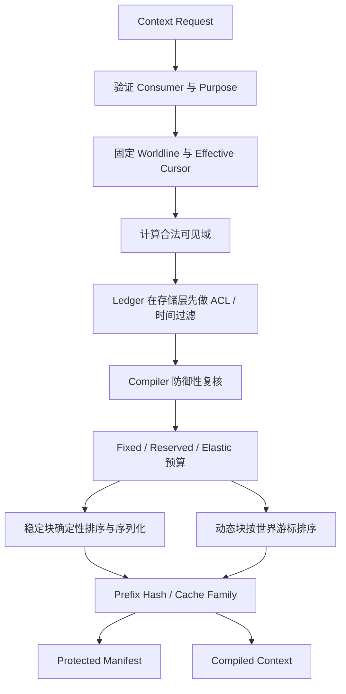

# 下一阶段开发规范：M1 正确性地基

> 文档性质：下一阶段实施规范，不记录当前完成进度。当前进度只以根目录 [`STATUS.md`](../../STATUS.md) 为准。
> 开发边界：只允许本机及可信内部局域网开发、自测和运行；禁止外部推送、部署、遥测和项目数据上传。

## 1. 阶段定义

M1 的任务不是增加更多“看得见的功能”，而是把当前最小原型变成后续秘密、记忆、工具、流式和世界线都能依赖的正确性地基。

核心结果：

```text
客户端命令
→ 幂等受理
→ 可恢复 Turn
→ 合法 Context
→ 模型/本地 Fake 候选
→ DM 校验
→ Record 单写入提交
→ Event + Observation + Outbox
→ 角色/玩家/DM 独立投影
```

## 2. 为什么现在做

当前原型已经验证交互方向，但存在以下结构风险：

- Core、API 和持久化仍存在重复的投影与提交语义；
- 模型上下文接口仍可能获得完整 Record；
- 世界时间仍主要以展示文本表示，无法安全过滤未来知识；
- 可见性尚未形成真实 ACL；
- 当前 D1 适配器是原型路径，不适合作为本机长期权威存储；
- 尚无 Command、Turn、Event 与 Outbox 的恢复链；
- 如果先接真实模型、记忆或流式，这些缺口会被重试和并发放大。

## 3. 范围

### 3.1 本阶段必须完成

1. Runtime Contract v1。
2. 结构化 WorldCursor 和 Worldline 绑定。
3. Event Plane 与 Visibility Policy。
4. Observation 和最小 Knowledge 时间语义。
5. Character、Principal、Narrator、DM 独立读取路径。
6. Context Ledger/Compiler、稳定前缀和受保护 Manifest。
7. 本地 PostgreSQL + pgvector 权威数据层。
8. Command Inbox、Turn Run、Record Head、Event 与 Outbox。
9. Core Application Service 成为唯一写入入口。
10. 已提交事件的本地 SSE 投影。
11. 现有前端等价迁移，以及角色视角/上帝视角边界展示。
12. 并发、幂等、崩溃恢复和秘密黄金场景测试。

### 3.2 本阶段明确不做

- 真实外部模型或供应商缓存；
- 正式 Embedding、向量召回和自动摘要；
- 完整长期记忆继承；
- 概率偷听与社会传播；
- 语义段流式、角色自动插话；
- 完整 TRPG 工具包；
- 飞书真实联调；
- Canon 审核和世界线正式分支；
- 外部 CI/CD 或部署。

## 4. 不可破坏的不变量

1. 展示历法文本不参与排序；同 Worldline 内只按 `tick + ordinal` 排序。
2. 不同 Worldline 的时间和知识不得直接混用。
3. `recordedAt` 不代表角色当时知道；知识以 `availableFrom / learnedAt` 为准。
4. 角色模型不得接收完整 `RecordProjection.events`。
5. Character Context 只能由共同知识、该角色 Observation、该角色 Knowledge、合法 Scene 状态和当前输入构成。
6. 不能先读取全知内容再删除秘密；Ledger 查询必须先按时间、世界线和可见域收窄。
7. 上帝视角只扩大 Principal UI 投影，不扩大 Character Context。
8. `dm_only` 和控制面内容不进入任何玩家投影。
9. Event、Observation、Record Head 和 Outbox 在同一正式事务内提交。
10. LLM/Fake 推理发生在数据库事务外，正式提交按 Record 串行。
11. Event 一旦提交不得原地改写，更正通过追加事件或新 Claim 版本表达。
12. Manifest 不进入模型、普通 API、浏览器日志或普通错误响应。
13. 缓存命中与否只影响延迟和成本，不改变语义。
14. 默认只监听本机，局域网访问必须显式开启。

## 5. 契约草案

### 5.1 世界时间

```ts
interface WorldCursor {
  tick: number;
  ordinal: number;
  calendarId: string;
  display: string;
}
```

- `tick`：世界观内可排序时间；
- `ordinal`：同 tick 的稳定顺序；
- `calendarId / display`：只负责显示；
- 系统创建和提交时间使用 ISO 时间戳，不能代替世界时间。

### 5.2 可见性

```ts
type VisibilityPolicy =
  | { kind: "public" }
  | { kind: "scene"; sceneId: string; observerCharacterInstanceIds: string[] }
  | { kind: "restricted"; domainId: string; characterInstanceIds: string[] }
  | { kind: "private"; characterInstanceId: string }
  | { kind: "dm_only" };
```

声明受众与实际观察者必须分离。秘密组成员变化不追溯改写旧事件；后来加入者不会自动获得旧秘密，离开者也不会失去已经形成的记忆。

### 5.3 Context Entry

```ts
interface ContextEntry {
  entryId: string;
  scope: ContextScope;
  category: ContextCategory;
  content: string;
  occurredAt: WorldCursor;
  availableFrom: WorldCursor;
  effectiveTo?: WorldCursor;
  visibility: VisibilityPolicy;
  budgetClass: "fixed" | "reserved" | "elastic";
  cachePolicy: "stable" | "dynamic";
  priority: number;
  estimatedTokens: number;
  sourceVersion: string;
}
```

`occurredAt` 与 `availableFrom` 分开，支持“事件早已发生，但角色后来才得知”。

### 5.4 Context Consumer

```ts
type ContextConsumer =
  | { type: "dm" }
  | { type: "narrator" }
  | { type: "character"; characterInstanceId: string }
  | { type: "principal"; principalId: string; perspective: "omniscient" }
  | {
      type: "principal";
      principalId: string;
      perspective: "character";
      characterInstanceId: string;
    };
```

Character 请求不能携带或继承 Principal 的上帝视角权限。

## 6. Context 编译管线



稳定物理顺序：

```text
P0 Runtime Protocol + Stable Tool Bundle
P1 Public Worldline Snapshot
P2 Public Story Snapshot
P3 Public Record Checkpoint
P4 Restricted Group Snapshot（如适用）
P5 Character Identity + Knowledge Snapshot
──────── Cache Boundary ────────
D1 Snapshot 后的合法增量
D2 本轮合法检索结果
D3 Scene、世界时间和工具权限
D4 当前输入与 Turn Contract
```

确定性要求：

- 模块顺序固定；
- ID 与字段顺序固定；
- 空白和标题固定；
- 稳定块不含当前系统时间、Trace ID 和随机 ID；
- Snapshot 确认后冻结，不逐轮重新措辞；
- 当前输入和最近事件只追加到动态尾部；
- Cache Family 必须包含 Consumer、世界线、协议、Snapshot 和 ACL 版本。

## 7. 本地数据层

### 7.1 权威存储

本阶段目标是切换为仅绑定本机的 PostgreSQL + pgvector。D1 只保留为原型适配器和迁移参考，不继续扩展为默认权威路径。

第一组权威表：

```text
workspaces
worlds / worldlines
stories / records / scenes
character_definitions / character_continuities / character_instances
participants / player_world_memberships
visibility_policies
command_inbox
turn_runs
record_heads
events
observations
context_snapshots
context_manifests
outbox
```

### 7.2 提交事务

```text
BEGIN
  锁定 record_head
  校验 expected_version
  校验 command 幂等指纹
  分配 record_version 与 ordinal
  写 Event
  写确定性 Observation
  更新 record_head
  写 Outbox
COMMIT
```

模型调用、上下文检索和较长的 DM 推理都不持有数据库事务。

### 7.3 数据迁移原则

- 先导出并核验当前演示数据；
- 新旧投影做等价对比；
- 切换默认读取前保留回退路径；
- 不自动删除现有 D1 本地数据；
- 数据迁移和代码切换分开提交。

## 8. 可恢复 Turn

状态机：

```text
accepted
→ planning
→ drafting
→ validating
→ releasing
→ completed

任一中间态 → failed / retryable
```

要求：

- Command 先持久化，再进入运行；
- 模型候选不是正式 Event；
- 相同 Command 重试复用已有结果；
- 进程在候选阶段中断可重新生成；
- 进程在提交后、投递前中断由 Outbox 恢复；
- 错误响应不透露秘密数量、标题或存在性。

## 9. API 与 Core 收敛

目标调用方向：

```text
HTTP Route
→ Application Service
→ Domain / Context Ports
→ Repository Adapter
```

规则：

- HTTP Route 只做输入校验、错误映射和返回 Projection；
- Fake Model 与未来真实模型都实现同一个 Provider Port；
- D1/PostgreSQL 只实现 Repository Port，不复制业务判断；
- Core 不导入 HTTP、React、数据库客户端或供应商 SDK；
- 只有 Delivery Projector 能生成玩家 UI Projection；
- 只有 Context Compiler 能生成模型 Context。

## 10. 前端工作

前端不重做视觉方向，严格遵守[界面设计规范](../design/UI-DESIGN.md)。

本阶段只增加：

- 服务端决定的角色视角/上帝视角标签；
- 秘密、仅本人、场景可见和 OOC 信息的清晰但克制标识；
- 安全的上下文说明，例如“基于公开记录、亲历观察和角色记忆”；
- 已提交事件 SSE 状态；
- 中断恢复、版本冲突和重新同步状态；
- Creator/DM 诊断能力保留入口占位，但不向普通玩家展示 Manifest。

不增加底层 Token、ACL、缓存和检索参数面板。

## 11. 黄金场景

固定测试夹具：

1. tick 100：A、B、C 在宴会大厅听到公开公告。
2. tick 105：A、B 进入密谋 Scene 并交换秘密。
3. C 只能观察到“两人离席十分钟”。
4. tick 120：C 通过显式测试数据获得一个失真传闻。
5. 同一真人以“上帝视角”控制 C。

必须满足：

- tick 110：A/B Context 含密谋原文；C Context 只含离席信息；
- 上帝视角 UI 可看密谋并标记为 OOC，但 C 的模型 Context 不含原文；
- tick 125：C 只读到传闻版本，不读到原始秘密；
- 当前输入变化不改变稳定前缀 Hash；
- 普通 API 与浏览器日志不含 Manifest、秘密源 ID 和排除原因；
- DM 可读控制面内容，Narrator 只能读取可公开叙述的世界内结果。

## 12. 测试计划

### 契约与时间

- 同 tick 按 ordinal 排序；
- 展示时间变化不改变顺序；
- `learnedAt > invocationTick` 时不可读；
- 跨 Worldline 读取失败；
- 已过有效期的状态不进入当前 Context。

### 可见性

- public、scene、restricted、private、dm_only 全覆盖；
- 新增/移除秘密组成员不追溯改变历史认知；
- 上帝视角 Principal 与 Character Context 完全隔离；
- Narrator 不读取控制面或私密原文；
- 不安全 Ledger 返回越权内容时 Compiler 立即拒绝。

### 缓存与 Manifest

- 数据返回顺序变化不改变稳定前缀；
- 当前输入变化只改变动态 Hash；
- Consumer、ACL、协议或 Snapshot 改变会改变 Cache Family；
- 安全说明不包含排除数量、秘密标题或秘密 ID；
- Manifest 只存在于控制面 Repository。

### 写入与恢复

- 同幂等键同内容返回原结果；
- 同幂等键不同内容拒绝；
- 20 个并发写入不产生重复 ordinal；
- Command、候选、Commit、Outbox 各阶段模拟中断；
- 迁移前后演示投影一致。

## 13. 推荐实施顺序

```text
1. 文档、契约与黄金 Fixture
2. Context Core 与纯单元测试
3. PostgreSQL Schema 和 Migration
4. Repository 与可恢复 Turn
5. API 统一到 Application Service
6. Delivery Projection 与 SSE
7. 前端等价迁移和视角标识
8. 并发、恢复、秘密与缓存回归
9. D1 默认路径退役
10. 本地运行手册与备份恢复演练
```

每一步独立提交；不得在一个提交中同时更换数据库、HTTP 框架、包管理器和前端框架。

## 14. M1 完成定义

只有全部满足以下条件，才能进入 M2：

- Runtime Contract v1 已冻结并有契约测试；
- Core、API 和存储共用同一正式提交语义；
- 本地 PostgreSQL 是默认权威存储；
- 时序、世界线、秘密和角色认知黄金场景全链通过；
- Context Compiler 是唯一模型读取入口；
- Manifest 与控制面没有出现在普通玩家路径；
- 并发、幂等、崩溃恢复和 Outbox 验证通过；
- 当前前端体验没有倒退，且保持既有设计语言；
- 所有本地质量门禁通过；
- 根目录 [`STATUS.md`](../../STATUS.md) 已追加对应事实记录。
