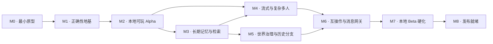

# 界核 / REALM 完整开发路线图

> 文档性质：产品与工程计划，不记录当前完成进度。当前进度只以根目录 [`STATUS.md`](../../STATUS.md) 为准。
> 适用边界：开发、自测和运行仅限本机及可信内部局域网；任何外部模型、消息平台、代码托管或部署都需要用户另行明确授权。

## 1. 路线图目标

本路线图将“可聊天的原型”演进为一个能够长期承载多人、角色自治、秘密、规则、记忆、时间线与世界演化的 Character Runtime。

所有阶段遵守以下优先级：

```text
时间、因果与权限正确性
> 正式状态可追溯性
> 角色自治与叙事质量
> 用户体验
> 响应速度与缓存成本
> 功能数量
```

## 2. 总体依赖



M8 只代表形成可发布候选，不代表允许发布。外部推送、部署、真实飞书联调或向第三方模型发送项目内容仍需单独授权。

## 3. 阶段总览

| 阶段 | 优先级 | 核心结果 | 主要依赖 |
|---|---:|---|---|
| M0 最小原型 | P0 | 验证产品形态、直角卡片前端、最小消息闭环 | 无 |
| M1 正确性地基 | P0 | 冻结契约，统一写入路径，建立时序与可见性边界、本地权威数据和恢复骨架 | M0 |
| M2 本地可玩 Alpha | P0 | DM、Narrator、角色和通用工具形成可靠的一轮叙事 | M1 |
| M3 长期记忆与检索 | P0 | 角色跨 Record 延续，关键词与向量检索在时间和权限边界内工作 | M1、M2 |
| M4 流式与复杂多人 | P1 | 语义段流式、打断、插话、多模型并行候选与串行提交 | M2、M3 |
| M5 世界治理与历史分支 | P1 | 世界知识、Canon 审核、回溯冲突与世界线分支 | M3 |
| M6 互操作与消息网关 | P1/P2 | ST 资产导入、飞书及统一 Gateway 的能力降级接入 | M4、M5 |
| M7 本地 Beta 硬化 | P1 | 长时间运行、备份恢复、升级迁移、局域网和安全验证 | M6 |
| M8 发布就绪 | 条件阶段 | 本地 Release Candidate、发布清单和 Go/No-Go 评审 | M7 |

## 4. M0：最小原型

### 目标

验证产品的核心交互是否成立，而不是提前实现完整平台。

### 范围

- World → Story → Record 基础导航；
- 真人玩家与 AI 角色演示；
- Fake Model 的确定性本地响应；
- Record 版本、幂等和最小单写入；
- 直角卡片、纸墨与朱红视觉语言；
- 本地读取、提交、错误恢复和响应式布局。

### 退出标准

- 当前事实以根目录 [`STATUS.md`](../../STATUS.md) 为准；
- 后续功能无需推翻核心产品界面即可继续生长。

## 5. M1：正确性地基

这是下一阶段。它把“能运行”升级为“后续能力可以安全生长”。详细实施规范见 [M1 正确性地基](./M1-CORRECTNESS-FOUNDATION.md)。

### 目标

- 冻结 Runtime Contract v1；
- 角色模型不再读取完整 Record；
- 世界时间、世界线、可见域和角色得知时间成为结构化约束；
- Core、API 与存储只保留一条正式写入链；
- 默认权威存储迁至仅本机运行的 PostgreSQL + pgvector；
- Command、Turn、Event 与 Outbox 可幂等、可恢复、可审计；
- 前端保持现有设计风格，只接收服务端生成的合法投影。

### 主要交付

1. 强类型 ID、WorldCursor、系统时间和版本化 Envelope。
2. World、Worldline、Story、Record、Scene、Turn、Participant、CharacterInstance 契约。
3. `public / scene / restricted / private / dm_only` 可见性策略。
4. Character、Principal、Narrator 与 DM 的独立读取路径。
5. Context Ledger、Context Compiler、稳定前缀、Cache Family 与受保护 Manifest。
6. 本地 PostgreSQL Schema、Migration 与开发启动方式。
7. `command_inbox / turn_runs / record_heads / events / outbox`。
8. API 只调用 Core Application Service，不再复制提交逻辑。
9. 已提交 Event 的本地 SSE 投影；本阶段不做 Token 流式。
10. 黄金场景：公开宴会、A/B 密谋、C 只知离席、C 后来获得失真传闻。

### 退出标准

- 角色在任一时点都读不到未来信息、平行世界线信息或无权秘密；
- 上帝视角玩家看到的 OOC 信息不会进入其角色模型上下文；
- Context Manifest 不进入普通 API、模型输入、浏览器日志和用户错误消息；
- 同一 Record 并发提交的 ordinal 连续且唯一；
- 相同幂等键只产生一次业务效果；
- Command、模型候选、Commit 与 Outbox 中断后均能恢复或明确失败；
- 本地演示投影迁移前后语义一致；
- 默认只监听 `127.0.0.1`，没有外部遥测、推送或部署。

### 不在本阶段

- 真实外部模型；
- Embedding 和正式向量检索；
- 自动摘要与长期记忆继承；
- 语义流式和角色自动插话；
- 完整通用工具包；
- 飞书联调；
- Canon、社会传播与正式世界线分支。

## 6. M2：本地可玩 Alpha

角色行动、规则裁决和 DM 职责边界的分批契约见 [M2 角色行动与规则裁决](./M2-ORCHESTRATION-AND-TOOLS.md)；语义片段和后续语音边界见 [M2 语义叙事与语音边界](./M2-SEMANTIC-PRESENTATION.md)；真实模型与记忆边界见 [模型与记忆运行时](../architecture/MODEL-AND-MEMORY-RUNTIME.md)。

### 目标

让一次叙事回合具备完整职责分离和严格结束条件。

### 主要交付

- DM Controller、Narrator、Character Runner 完全分离；
- Goal、Turn Contract 和 Validator 管线；
- DM 只激活角色，不替角色决定立场；
- Narrator 只叙述当前受众可公开感知的结果；
- Character 使用 `act / use_skill / use_asset / take_stance` 声明自然行动；
- Action Resolver、Rule Pack、Action Receipt 与 Action Transaction；
- `resolve_uncertainty / consume_resource / apply_effect` 仅作为引擎内部工具；
- 弱工具模型使用结构化 Intent Compiler 降级，不使用关键词触发或 DM 代理；
- 仅对歧义、不可逆和高价值操作二次确认；
- 世界创建、角色创建、故事创建和 Record 创建的最小 UI；
- 玩家 Perspective 创建时锁定，动态知识面板开关可变。
- Event 原生携带环境、剧情、事实、动作与台词语义片段，为后续语音与打断提供稳定边界。
- 行动框以自然语言为主，通过渐进披露面板展示服务端判定为当前可用的技能、资产、姿态与场景交互；选择项提交稳定 ID，不依赖文本猜测。
- 技能归属、物品余额、活动效果与 Action Receipt 使用本地 PostgreSQL 权威账本，并与正式回合原子发布。

### 退出标准

- 本地模型或 Fake Provider 能完成一轮 DM → 角色/旁白 → 校验 → 提交；
- 缺少 Actor Tool 或 Receipt 时不会跳过规则，也不会静默制造角色意图；
- 行动重试不会重复扣除、重复随机或重复施加状态；
- 不完整、越界或违反世界观的输出不会进入正式记录；
- DM 控制面内容不会出现在 Narrator 或玩家投影中。
- 行动面板不会展示无权、失效或尚无持久化执行能力的选项，伪造稳定 ID 会失败关闭。

## 7. M3：长期角色、记忆与混合检索

### 目标

让角色在长时间、跨 Record 和世界演化中保持合法而连续的主观认知。

### 主要交付

- CharacterDefinition、CharacterContinuity、CharacterInstance 三层持久化；
- Observation、KnowledgeClaim、Memory 与 Relationship；
- 新实例只继承同一连续体、同一世界线祖先和目标时间之前的记忆；
- PostgreSQL 全文检索 + pgvector + 图邻接 + 最近性；
- 权限、世界线和有效时间先过滤，再进行关键词/向量 Top-K；
- Episodic、Semantic、Decision 与分域 Summary；
- Public、Restricted、Character 与 DM 摘要独立生成；
- 不可变 Snapshot、Delta 和 Cache Epoch；
- 用户只看到“精简 / 平衡 / 沉浸”三档，不暴露底层检索旋钮。

### 退出标准

- 新 Record 不继承未来、平行世界线或无权记忆；
- 关键词和向量召回均不能扩大 ACL；
- Manifest 能在控制面解释入选来源，但安全说明不泄露秘密存在性；
- 长 Record 能在固定 Token 预算下维持当前输入、场景硬状态与未闭合工具链；
- Relationship 与客观世界关系不会混为一谈。

## 8. M4：语义流式、插话与复杂多人

### 目标

在不破坏正式事件一致性的前提下，让多人对话自然发生。

### 主要交付

- 完整语义句/短段级 Preview；
- Preview 与 Commit 分离；
- 用户显式打断、取消和恢复；
- DM 自动插话判断、少量角色预算和强沉默偏置；
- 发言权、队列、冷却与 TurnControlLease；
- 多个模型并行生成候选，正式状态按 Record 串行提交；
- 工具调用暂停后续写，结果提交后再继续；
- 已提交事件 SSE 断线续传；
- STT/TTS 只消费已授权的结构化语义片段，不以正文控制字符充当分隔符；
- 一对一、一对多、多对一和多对多场景回归。

### 退出标准

- 被打断的未提交内容不会污染历史；
- 已提交事件在断线重连后不重不漏；
- 多模型竞争不能造成 Record 双写；
- 自动插话不会形成角色抢话风暴；
- 一个角色的多人共控只有显式开启后才生效。

## 9. M5：世界治理、历史分支与社会传播

### 目标

让 Record 中的关键变化能够受控地改变 Story 和 World，并正确处理回溯造成的因果冲突。

### 主要交付

- Entity、Relation、Claim、Article 与 CausalEdge；
- 地理、历史、设定、势力和人物的结构化世界记忆；
- Record → Story → Worldline Canon Proposal；
- DM 将关键决策包装为世界观文章，用户决定是否合并；
- CausalChangeSet、确定性冲突、依赖图冲突与 DM 语义冲突；
- `none / bridgeable / hard / high-risk` 冲突分级；
- 过去重大变更默认建议创建 Worldline 分支；
- 已有未来 Record 永不被静默改写；
- Information Campaign、Packet、Channel、Exposure 与失真；
- 高层情报按身份、兴趣、智力、路径、延迟和可信度传播。

### 退出标准

- 过去杀死未来仍存活人物时可检测硬冲突；
- 旧世界线 Record 保持不可变；
- 普通 Record 事实不逐条打扰用户，高层变化才进入 Canon 审核；
- 官方公告、商队传闻和密信产生不同且可复现的传播结果；
- 无合法传播路径时，角色不会凭空获得高层情报。

## 10. M6：互操作与消息网关

### 目标

在不污染 Core 的情况下接入外部资产格式和消息平台。

### 主要交付

- SillyTavern 角色卡与世界书导入、校验、预览和回滚；
- 导入内容按不可信数据处理，不获得系统指令权限；
- 统一 Gateway Envelope、身份映射、去重和平台能力声明；
- 飞书群映射 Record、私聊映射主控台；
- 首版完成后一次发送；
- 私密消息仅走合法私密通道，无法满足时明确拒绝；
- Web 继续提供完整体验，平台 Gateway 只做能力降级适配。

### 退出标准

- 导入失败不会污染正式世界；
- 同一平台消息重复投递只产生一次业务效果；
- 群消息不会跨 Record 串线；
- 平台不具备私密能力时不会把密谋降级成公开消息；
- 实际飞书或其他外部平台联调必须在用户另行授权后进行。

## 11. M7：本地 Beta 硬化

### 目标

证明系统可以被单人在本机和可信局域网长期、安全地使用。

### 主要交付

- 单命令启动、停止、迁移、备份和恢复；
- 本机默认绑定与局域网显式开启；
- 72 小时长时间运行验证；
- 数据库升级与回滚演练；
- 大 Record、长时间线、多角色和高并发压力测试；
- 日志脱敏、磁盘配额、失败恢复和成本统计；
- 无障碍、键盘、触控和响应式回归；
- 本地威胁模型与隐私审查。

### 退出标准

- 备份可恢复到一致 Record Head；
- 升级失败可回滚；
- 局域网未显式开启时没有非本机监听；
- 长时间运行无数据重复、ordinal 断裂或秘密泄漏；
- 关键用户路径在桌面、平板和手机布局中可用。

## 12. M8：发布就绪

### 目标

只在本地形成可审阅的 Release Candidate 和发布决策材料。

### 主要交付

- 版本说明、数据迁移说明、运行手册和故障恢复手册；
- 依赖、许可证、秘密处理和安全审阅；
- 本地安装包或容器包；
- 发布 Go/No-Go 清单；
- 外部模型、飞书、代码托管和部署的逐项授权清单。

### 退出标准

- Release Candidate 可在全新本机环境恢复演示世界并完成回归；
- 所有外部动作仍保持关闭；
- 只有用户明确给出发布授权后，才另建发布阶段。

## 13. 跨阶段质量门禁

每个阶段都必须满足：

1. 类型检查、单元测试、构建和代码规范检查通过。
2. 数据迁移可重复执行，失败不会静默丢数据。
3. 新状态变化具有幂等键、因果来源和可审计结果。
4. 角色 Prompt 不得读取全量 Record 或 Principal 全知投影。
5. 用户可见 API 不返回受保护 Manifest、控制面推理或秘密排除信息。
6. 界面遵守[界面设计规范](../design/UI-DESIGN.md)，不引入第二套视觉语言。
7. 默认不访问外部模型、平台、遥测、托管或代码仓库。
8. 完成事实必须按规则追加到根目录 [`STATUS.md`](../../STATUS.md)。

## 14. 决策门

以下事项必须在进入对应实施点前单独确认：

- 本地 PostgreSQL 的安装与数据目录策略；
- 本地模型运行方式及硬件预算；
- 局域网鉴权和 TLS 策略；
- 真实飞书应用和权限范围；
- 任何外部模型供应商及允许发送的数据；
- 任何外部源码托管、持续集成或部署；
- 正式发布许可与目标平台。
